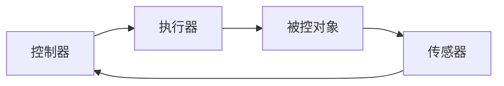

# 控制器

## 功能

功能：通过逻辑计算，把逻辑值下发给执行器，从而改变被控对象的状态。

```mermaid
graph LR;

    控制器-->执行器;
    执行器-->被控对象;
    被控对象-->传感器;
    传感器-->控制器;

```

## 常见控制器

### PID控制器

无模型控制器，不需预先知道系统的传递函数就可以使用。

神奇的是PID控制器在绝大多数工程中可可用的，我们只需要调节PID参数即可获取到一个不错的控制效果。

