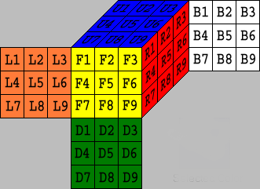

## 目的

为了更好的理解Kociemba二阶算法，遂翻译其主页。便于算法理解，后续4阶魔方还原算法参考。

## Facelet层面置换 

三阶魔方共有 6*9=54 个facelets

一次转动会使得facelets重新排列，我们把这个称之为置换。

U, R, F, D, B, L 代表着对应面顺时针旋转90°;
U2, R2, F2, D2, B2, L2 代表着对应面旋转180°;
U', R', F', D', B', L' 代表着对应面逆时针旋转90°.

F旋转会有如下结果

1. F1移动至F3 (F1-›F3), F2-›F6, F3-›F9, F4-›F2, F5-›F5, F6-›F8, F7-›F1, F8-›F4, F9-›F7.
F1 F2 F3 F4 F5 F6 F7 F8 F9
F3 F6 F9 F2 F5 F8 F1 F4 F7

2. F1被F7替换 (F1‹-F7), F2‹-F4, F3‹-F1, F4‹-F8, F5‹-F5, F6‹-F2, F7‹-F9, F8‹-F6, F9‹-F3. 
F1 F2 F3 F4 F5 F6 F7 F8 F9
F7 F4 F1 F8 F5 F2 F9 F6 F3

(F3,F6,F9,F2,F5,F8,F1,F4,F7)是“移动至”的表示方式
(F7,F4,F1,F8,F5,F2,F9,F6,F3)是“被替换”的表示方式

facelet阶段我们用“移动至”的表示方式，cobie阶段用“被替换”的表示方式。

在移动至的表示方式下，我们定义乘法如下：

F1 F2 F3 F4 F5 F6 F7 F8 F9
F2 F1 F6 F3 F5 F4 F8 F7 F9

\*

F1 F2 F3 F4 F5 F6 F7 F8 F9
F3 F6 F9 F2 F5 F8 F1 F4 F7

=

F1 F2 F3 F4 F5 F6 F7 F8 F9
F6 F3 F8 F9 F5 F2 F4 F1 F7

和普通乘法定义不同的是，置换的乘法不满足交换律。

当然从F和F'的操作结果，我们知道F\*F'=I.

F'就代表F的逆，这种情况下乘法是满足交换律的。

F'\*F=I

F转动的完整的表达

F:=(U1,U2,U3,U4,U5,U6,R1,R4,R7,D3,R2,R3,D2,R5,R6,D1,R8,R9,F3,F6,F9,F2,F5,F8,F1,F4,F7,L3,L6,L9,D4,D5,D6,D7,D8,D9,L1,L2,U9,L4,L5,U8,L7,L8,U7,B1,B2,B3,B4,B5,B6,B7,B8,B9)

因为有些facelet是有固定位置关系的，比如棱和角或者中心面。

所以facelet阶段的表达方式并不是很简洁，这也是为什么有cobie阶段存在。

## Cobie层面置换

这一层面我们置换的对象不再是facelets了，而是12条边和8个角。

12条边：UR, UF, UL, UB, DR ,DF, DL, DB, FR, FL, BL, BR

8个角：URF, UFL, ULB, UBR, DFR, DLF, DBL, DRB

cobie阶段不能仅靠边和角的排列组合表示魔方的状态，因为边和角是有方向的。

在初始位置上，角可以旋转，边也可以翻转。

在这一层面，我们用“被替换”的表达方式，表示一次旋转

同样还是F，URF被UFL替换(URF‹-UFL), UFL‹-DLF, ULB ‹-ULB, UBR‹-UBR,
DFR‹-URF, DLF‹-DFR, DBL ‹-DBL, DRB‹-DRB

可以表示如下：

|URF| UFL| ULB| UBR| DFR |DLF |DBL| DRB|
|--|--|--|--|--|--|--|--|--|
|UFL |DLF |ULB |UBR| URF| DFR| DBL| DRB|

因为角是有方向的

|URF | UFL | ULB| UBR| DFR| DLF| DBL| DRB|
|--|--|--|--|--|--|--|--|--|
|c:UFL;o:1 | c:DLF;o:2 | c:ULB;o:0 | c:UBR;o:0 | c:URF;o:2 | c:DFR;o:1 | c:DBL;o:0 | c:DRB,o:0 |

0:未旋转；1：顺时针旋转；2：逆时针旋转
如果有两个旋转是2+2=4，4对3取模得1，表示是一个顺时针旋转。

边也可以用类似的方式表示
0：未翻转；1：翻转

F用公式可以如下表示

F(URF).c = UFL
F(URF).o = 1
F(UFL).c = DLF
F(UFL).o = 2
...

R =
|URF| UFL| ULB |UBR| DFR |DLF| DBL| DRB|
|--|--|--|--|--|--|--|--|--|
|c:DFR;o:2| c:UFL;o:0| c:ULB;o:0| c:URF;o:1 |c:DRB;o:1| c:DLF;o:0 |c:DBL;o:0 |c:UBR,o:2|

F\*R 

F(URF).c = UFL and F(URF).o = 1
R(UBR).c = URF and R(UBR).o= 1

F：URF‹-UFL ,R: UBR‹-URF, 所以F\*R的结果是 UBR‹-UFL. 
(F*R)(UBR).c = UFL. 
(F*R)(UBR).c = F(R(UBR).c).c.

方向的变换稍微复杂些

(F*R)(UBR).o=F(R(UBR).c).o+R(UBR).o.

任意位置x处，A\*B 有：
(A\*B)(x).c=A(B(x).c).c
and
(A\*B)(x).o=A(B(x).c).o+B(x).o

>If we want also want to include the case of reflections, which we need if we apply symmetries of the cube, thing are a bit more complicated with the orientations of the corners. Instead of adding modulo 3 in the second equation above, which can be interpreted as a group operation in the cyclic group C3, we then work in the dihedral group D3. We describe the three extra elements in this group with the numbers 3, 4, and 5.

## Coordinate 层面

我们用自然数表示对边和角的状态，即对边和角的状态进行编码。

### 角的方向编码

R

|URF| UFL| ULB |UBR| DFR |DLF| DBL| DRB|
|--|--|--|--|--|--|--|--|--|
|c:DFR;o:2| c:UFL;o:0| c:ULB;o:0| c:URF;o:1 |c:DRB;o:1| c:DLF;o:0 |c:DBL;o:0 |c:UBR,o:2|

0 - 2186 (3^7 - 1).

`2*3^6 + 0*3^5 + 0*3^4 + 1*3^3 +1*3^2 + 0*3^1 + 0*3^0 = 1494`

其实就是把3进制2001100用十进制1494表示。

为什么不算DRB呢？因为可由7个角的方向确定最后一个方向。

### 边的方向编码

12 条边的表示范围 0 - 2047 (2^11 - 1)

### 角的位置编码

0 - 40319 (8! - 1).

|URF| UFL| ULB |UBR| DFR |DLF| DBL| DRB|
|--|--|--|--|--|--|--|--|--|
|c:DFR;o:2| c:UFL;o:0| c:ULB;o:0| c:URF;o:1 |c:DRB;o:1| c:DLF;o:0 |c:DBL;o:0 |c:UBR,o:2|
||1| 1| 3| 0| 1| 1| 4|

人为指定角的顺序 `URF<UFL<ULB<UBR<DFR<DLF<DBL<DRB`

最后一行代表第二行中左边序号大于当前的个数

c:URF左侧的DRF,UFL,ULB都比URF大，所以是3

c:UBR左侧的DRF,DRB,DLF,DBL比UBR大，所以是4

`1*1! + 1*2! + 3*3! + 0*4! + 1*5! + 1*6! + 4*7! = 21021`

### 边位置编码

类似的方式可知，编码范围 0 - (12! - 1)

### 总的状态数

魔方的状态可根据边角的位置、方向共同决定

`(3^7) * (2^11) * (8!) * (12!)`

因为有奇偶性，所以要除2

`3^7 * 2^11 * 8! *12! /2 = 43,252,003,274,489,856,000`

暴力穷举基本不用想了

## 等效和对称

## 陪集

## 坐标和对称

## 二阶算法

## 转动表

## 裁剪表

## 二阶算法详情

## 最优解

