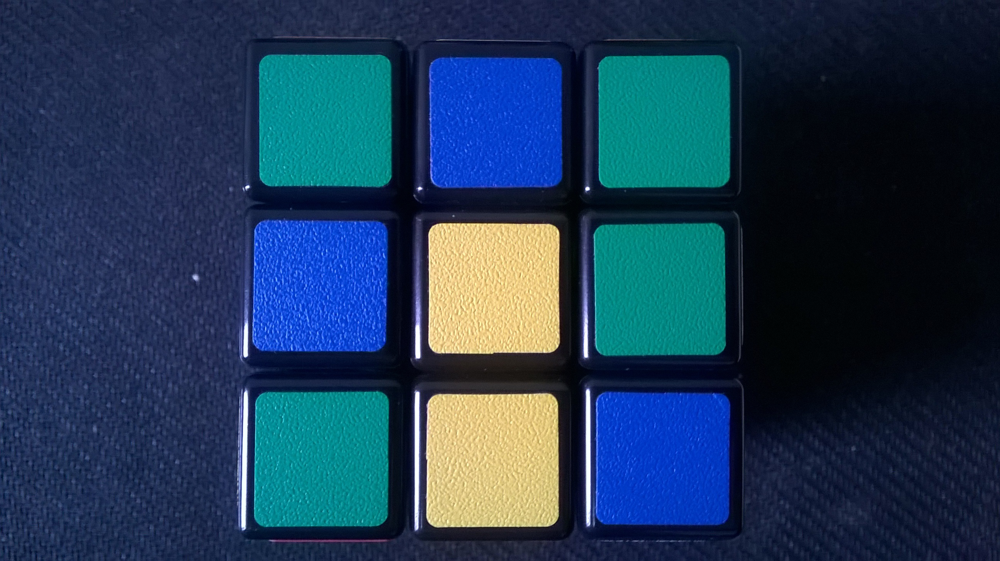
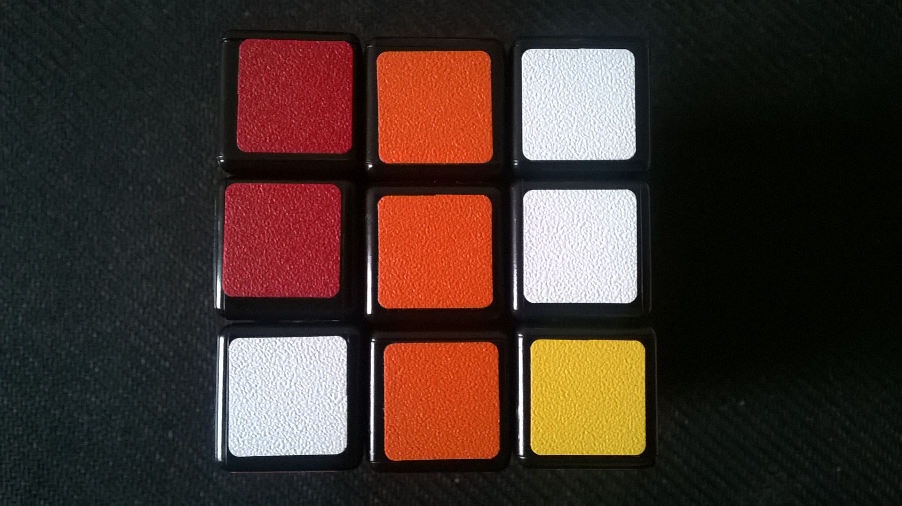
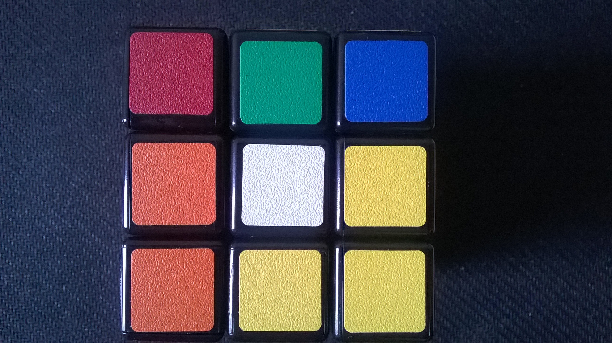
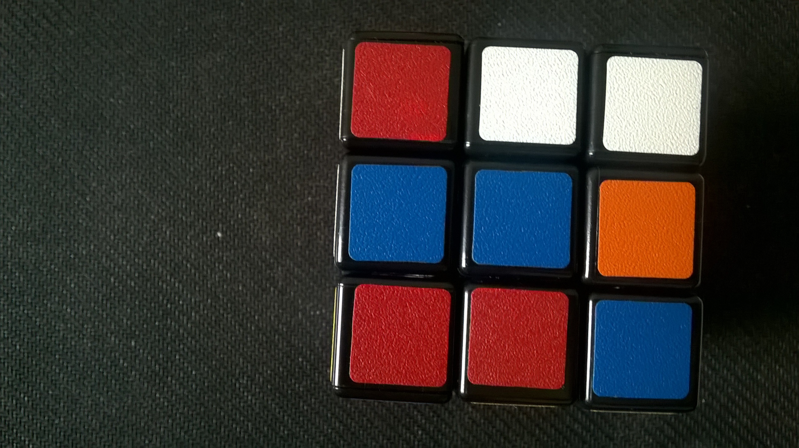
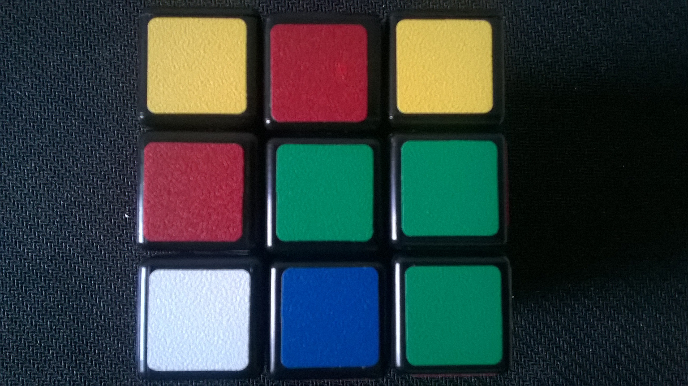
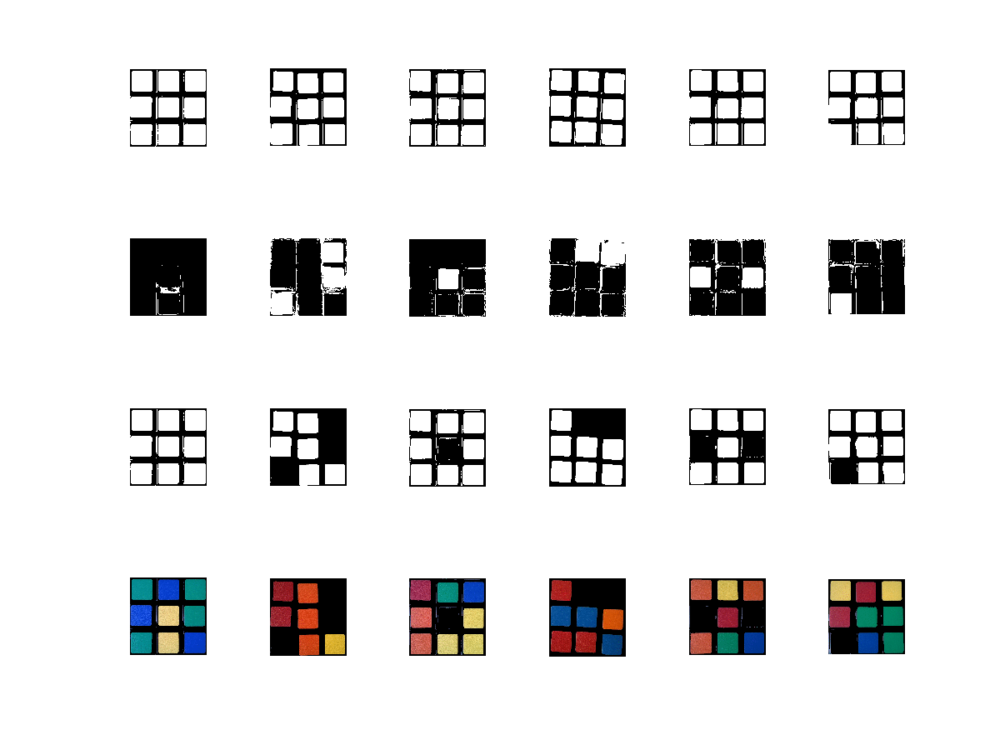

<!---
版本    日期    作者    描述
v1.0    2019.06.25  lous    文件创建
-->

为了完成在校时的愿望，最近开始拾起了魔方还原助手的。最终目标：上架各大应用市场，作为一款应用软件为广大魔方爱好者提供帮助。

如果你对此项目也感兴趣，请不要重复造轮子。我们会非常欢迎的你加入！

用户直接通过手机按一个简单的规则拍摄六个面的照片，然后软件开始通过图像识别算法建立魔方当前状态。算法完成后，通过图像或者动画示意具体的还原步骤（平均控制在30步以内）。

最终只需要不到1分钟，初学者也能还原一个被打乱的魔方。

## 颜色识别

### 数据采集

因为不打算用复杂的深度学习算法，所以对数据作了一定的限制。

假设魔方是一个常见的六色3阶魔方，即每个色块都为纯色。

表面U

前面F

下面D

右面R

后面B

左面L

当时拍摄的是用Nokia，能看到是有明显的色差的

有几个色块肉眼已经很难分辨出到底是什么颜色了，我们希望在这个场景下依旧能够识别处魔方各个面色块的分布情况。

### HSV

RGB空间并不适合于我们对颜色的主观判断

把图像转换至HSV空间

原始图像

Hue

Saturation

Value

### 阈值自适应

通过value分量可以估算处黑色的光强范围，是否可以考虑加入灰度平衡？

饱和度用于识别处白色的区块，这是因为HSV空间中黑色和白色的色调比较特殊。

剔除了黑色和白色区域后，统计剩下区域的色调分布，其分布应该是聚集在hue尺度上五个不同的区域，需要注意到hue会翻转。

saturation_weight = 0.95;
sv_thresh = 0.75;
black_value_thresh=0.2;

$Value < black\_value\_thresh$

$(1-saturation\_weight)*Value+ saturation\_weight *(1-Saturation) > sv\_thresh$

