<!---
版本    日期    作者    描述
v1.0    2019.06.25  lous    文件创建
-->

为了完成在校时的愿望，最近开始拾起了魔方还原助手的。最终目标：上架各大应用市场，作为一款应用软件为广大魔方爱好者提供帮助。

如果你对此项目也感兴趣，请不要重复造轮子。我们会非常欢迎的你加入！

用户直接通过手机按一个简单的规则拍摄六个面的照片，然后软件开始通过图像识别算法建立魔方当前状态。算法完成后，通过图像或者动画示意具体的还原步骤（平均控制在30步以内）。

最终只需要不到1分钟，初学者也能还原一个被打乱的魔方。

## 颜色识别

### 数据采集

因为不打算用复杂的深度学习算法，所以对数据作了一定的限制。

假设魔方是一个常见的六色3阶魔方，即每个色块都为纯色。

表面U

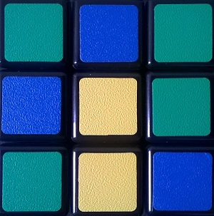

前面F

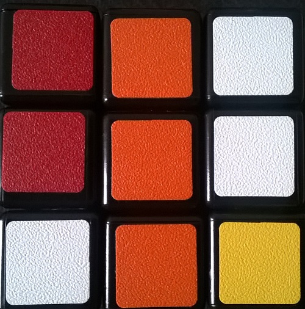

下面D

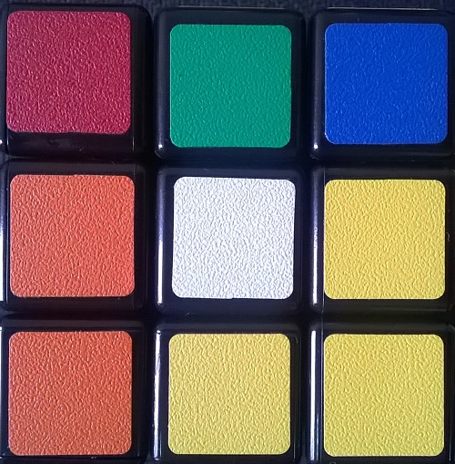

右面R

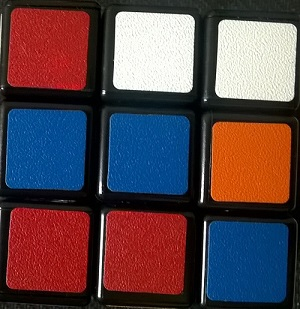

后面B

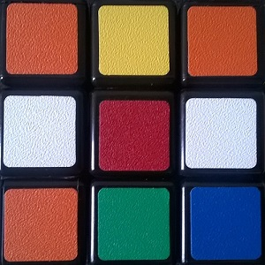

左面L

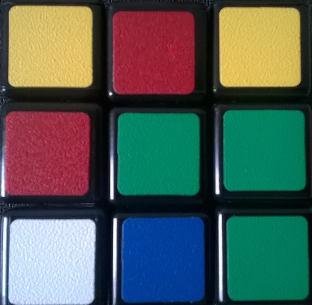

当时拍摄的是用Nokia，能看到是有明显的色差的

有几个色块肉眼已经很难分辨出到底是什么颜色了，我们希望在这个场景下依旧能够识别处魔方各个面色块的分布情况。

### HSV

RGB空间并不适合于我们对颜色的主观判断

把图像转换至HSV空间

原始图像

Hue

Saturation

Value


### 阈值自适应

通过value分量可以估算处黑色的光强范围，是否可以考虑加入灰度平衡？

饱和度用于识别处白色的区块，这是因为HSV空间中黑色和白色的色调比较特殊。

剔除了黑色和白色区域后，统计剩下区域的色调分布，其分布应该是聚集在hue尺度上五个不同的区域，需要注意到hue会翻转。


saturation_weight = 0.95;
sv_thresh = 0.75;
black_value_thresh=0.2;

$Value < black\_value\_thresh$

$(1-saturation\_weight)*Value+ saturation\_weight *(1-Saturation) > sv\_thresh$


到这一步就把彩色部分提取出来了，下一步我们需要根据色调对颜色进行分类。

提取到彩色的部分，并对所有像素点做统计。

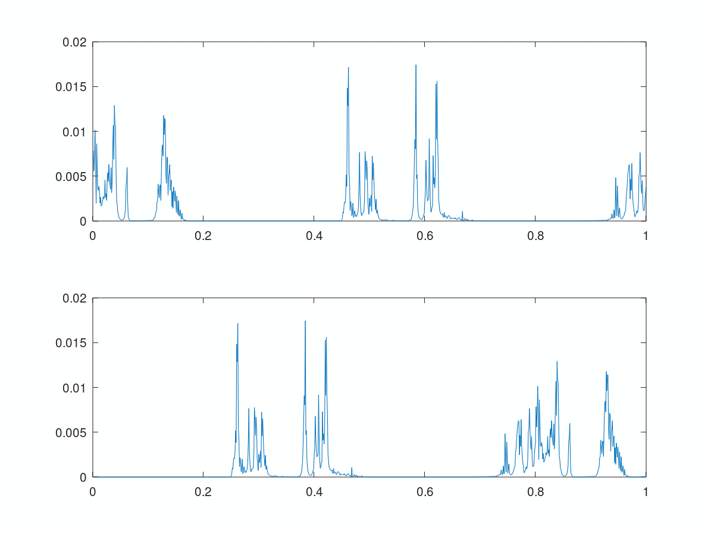

因为已经剔除了白色，所以理想情况下我们应该能看到五个明显簇。但从直方图上我们只能看到四个。因为hue可以反转（0和1可以代表同一个颜色-红色），所以我们很难在这幅图上直接统计出几个色块的平均Hue值。

因为我们可以直接给出两个颜色之间的相差程度，即在Hue圆周上的夹角，因为rgb转到HSV时已经归一化了，所以两个颜色$hue_a$和$hue_b$之间的距离

$$
D(a,b)=0.5-abs(abs(hue_a-hue_b)-0.5)
$$

是否可以考虑用聚类分析的方法把所有点先分类，然后再计算质心（单面纯色的估计值）。

测试了下K-means，效果不理想。

假设同一个面的hue偏差不超过0.05，我们可以滑动计算宽度为0.1的窗口内总的点数，窗口内总的点数占比应该是接近0.2的。

固定大小的窗口移动统计总点数后

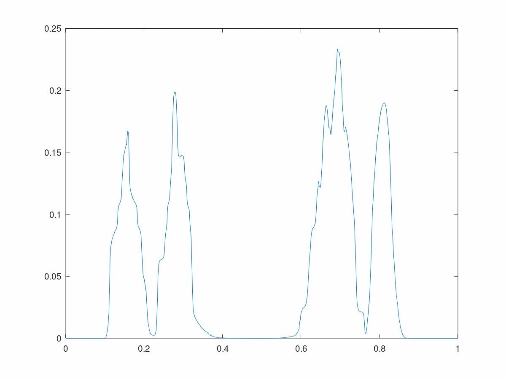

可以看到在0.6-0.8之间是有混淆的

初步估计5个值应该是0.15 0.28 0.68 0.73 0.83

也就是说我们根本无法直接计算出0.7左右的两个hue值，但是可以通过概率估计

突然想到了在做声纹识别时的一种特征提取方法，混合高斯模型。

事实上我们可以认为色调的偏差分布是一个高斯分布，这样估算出的五个均值应该会非常接近理论值。

```
Clust 1: weight 0.420881
        Mean: 0.248413
        Variance: 0.0044690
Clust 2: weight 0.300516
        Mean: 0.747398
        Variance: 0.0042292
Clust 3: weight 0.119645
        Mean: 0.748971
        Variance: 0.0042653
Clust 4: weight 0.0805644
        Mean: 0.748187
        Variance: 0.0042491
Clust 5: weight 0.0783928
        Mean: 0.748112
        Variance: 0.0042475
```

实际依旧不理想……

从以上的尝试方法来看，我们可能需要有些先验知识。

- 我们知道的是每个颜色应该是9个色块，不多也不能少。
- 就算一张图上相机自身校正的色彩，两个不同的颜色也应该有一定差异，不然我们肉眼也无法分辨。
- 每个方块应该是一个正方形，可以有轻微的形变。

我们已经获取到了每一张图像上的除黑白外的mask。

但是图像有噪点，通过腐蚀去除。


左边是原始mask，右边为腐蚀之后的mask。

重新统计hue值在 $width = \pm 0.05$ 的窗口内的总像素点的占比

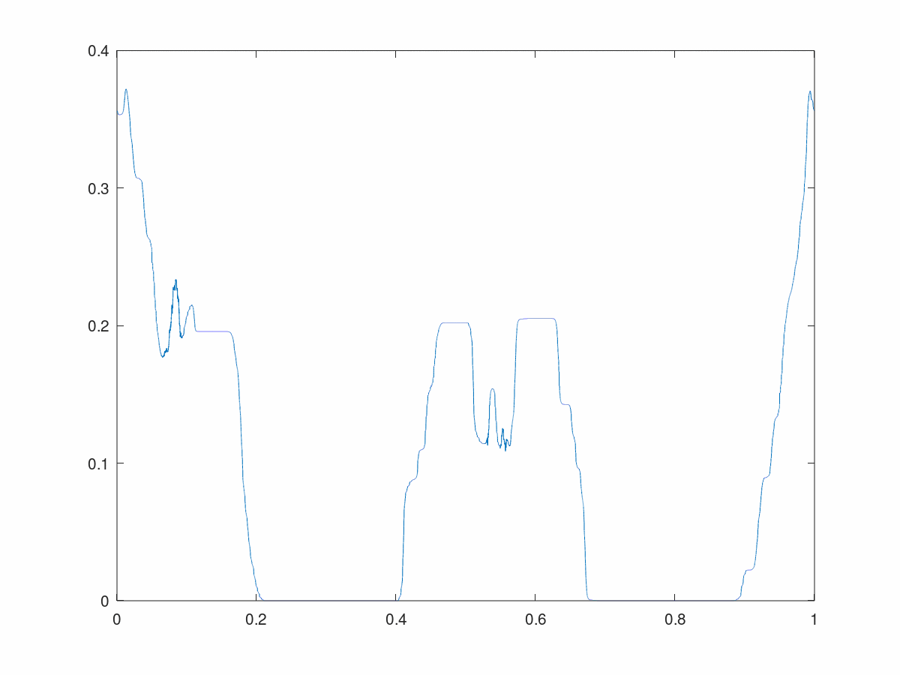

0.15 0.5 0.63 附近能看到有三个占比稳定在0.2的区域

我们只要统计占比在20%左右的平稳区域就可找到几个比较好区分的颜色。

平稳只需根据窗口内占比的方差做个简单判断。比如占比之和稳定在0.02的窗口内，
标准差0.05以内占比在0.2左右的平滑区域。

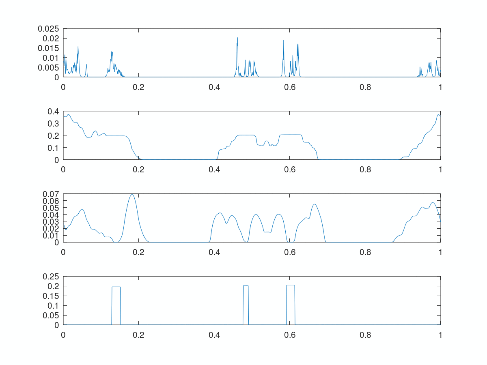

原始直方图

一定宽度内的占比

一定宽度内占比的标准差

稳定在一定宽度内占比为0.2的区域

这些区域的中心就是各色块hue值的中心值

通过连通域计算出中心为

 `0.14000   0.48350   0.60250`


到这一步，我们除了识别出黑白，还有以下几种颜色


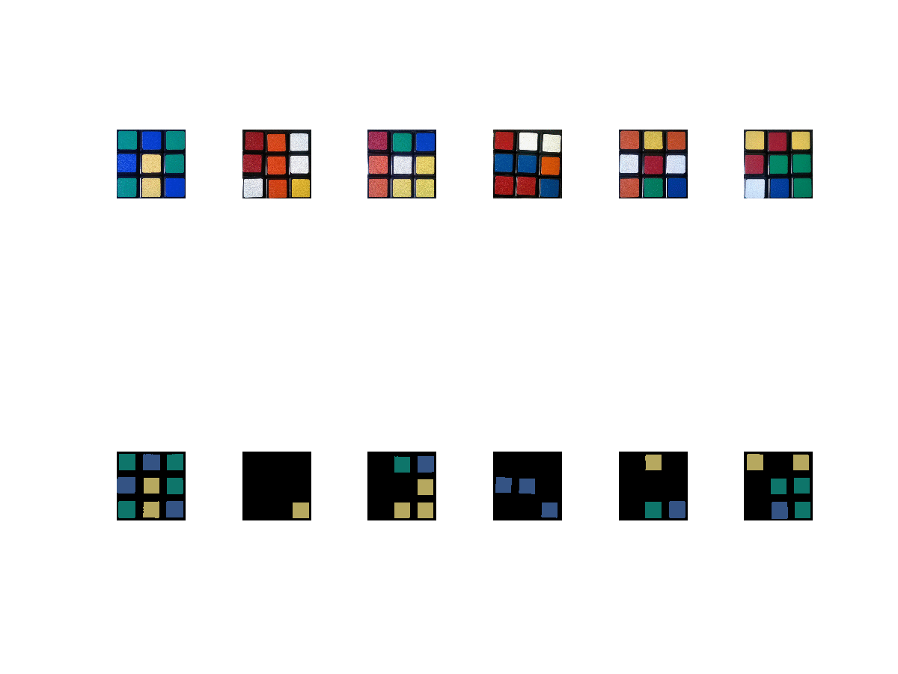

#### 识别边缘颜色

换了个魔方后，之前的识别效果差了很多。主要是因为魔方一个是白边一个是黑边。

因此我们首先需要分析出魔方边缘的颜色，并根据这个颜色确定每个色块的大概中心位置。

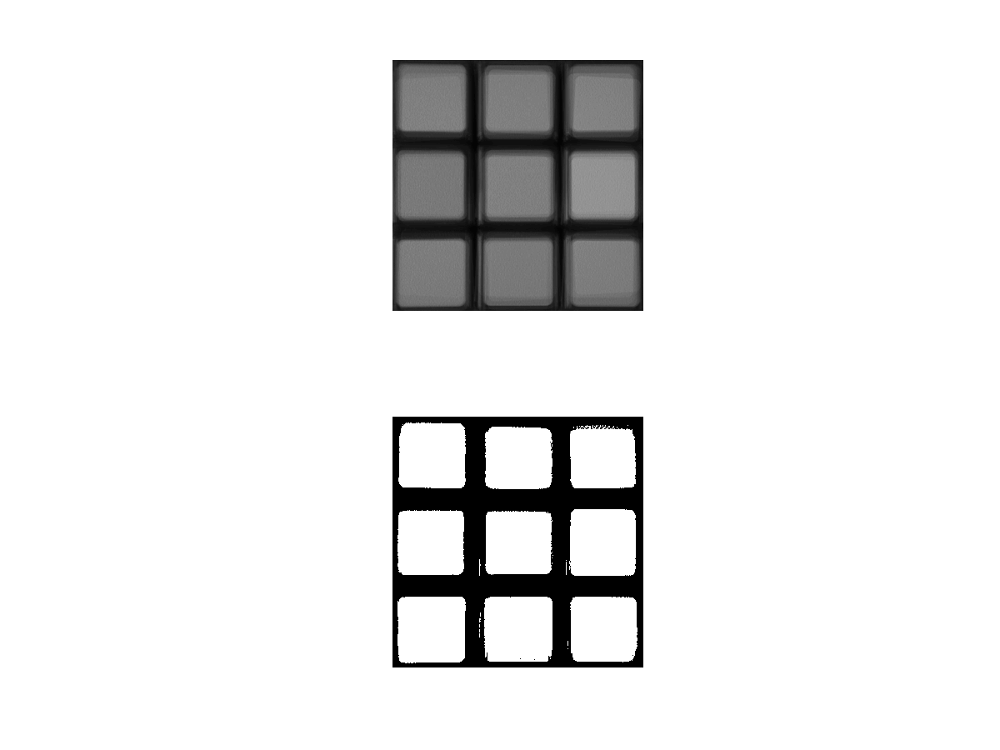

二值化方法，计算全局平均值，并以平均值作为阈值二值化灰度图。

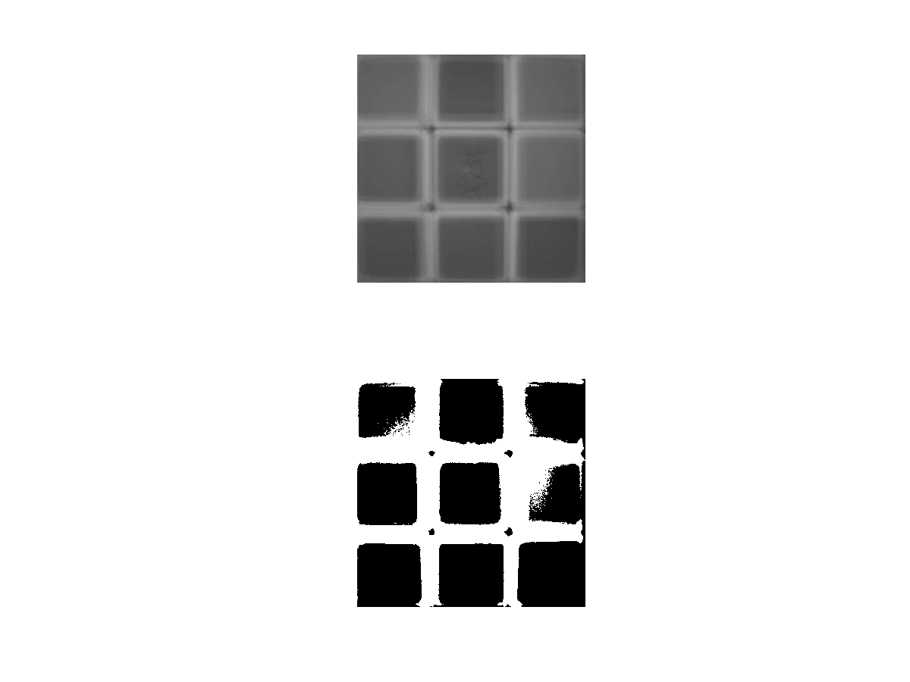

白边魔方以同样的二值化方法处理后，效果并不好

我们需要先估计出边的颜色，如果是黑色，这届通过灰度二值化得到mask，而如果估计是白色，我们需要通过饱和度和灰度加权分析是白色二值化的阈值。

#### 识别白色区域

识别完边缘后，第一步需要做的是识别出最特殊的颜色，白色。


```
white_facelet =

  0  0  1
  0  0  0
  0  0  0

white_facelet =

  0  0  1
  1  1  0
  1  0  0

white_facelet =

  0  0  0
  0  0  0
  0  0  0

white_facelet =

  0  0  0
  0  0  1
  0  1  0

white_facelet =

  0  0  1
  0  0  0
  0  0  0

white_facelet =

  0  0  0
  0  0  1
  0  0  0
```

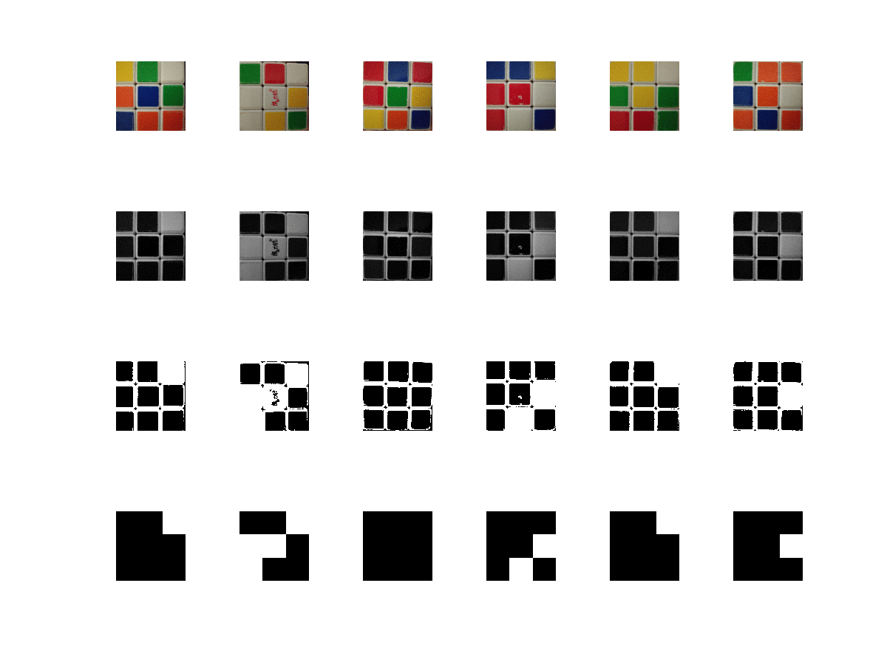

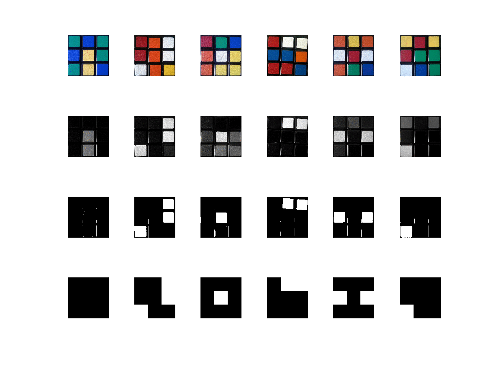


### 色调

对非黑白区域的色调，排序

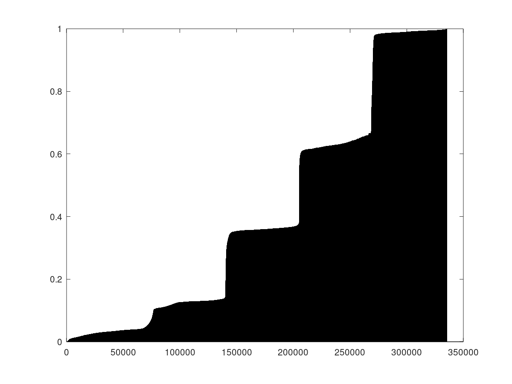

1至0翻转处连接还是比较平缓，这样并不便于颜色的拾取。

色块中心处的hue
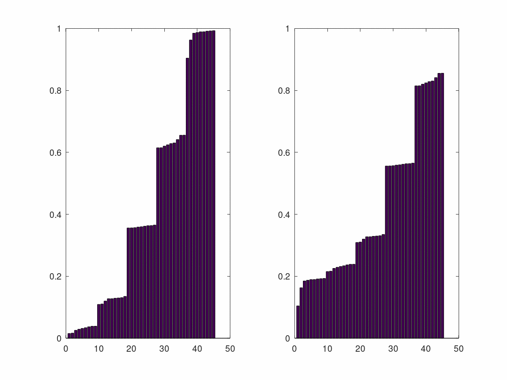

### 白边魔方目前可以识别出来

黑边待研究

主要是之前采集的图像质量太差了，换个手机采集后识别效果明显好了


### 安卓手机拍照后识别


色块中心处的hue


hue值直方图明显好了许多


```
kociemba.solve('DLFDUDRLLUBRBRFLBLDUFUFUBLUDDBFDRBFDBRFULRURRUBLDBFFLR')

"B2 L' U' B R2 U' R' B U' R' L2 B2 R2 D' L2 D B2 L2"
```


用另一个黑边的魔方重新测试


octave识别

```
Up.png
   2   5   3
   5   6   6
   2   2   4
Front.png
   3   3   6
   4   1   4
   4   5   6
Down.png
   6   3   5
   2   2   1
   6   2   1
Right.png
   1   3   4
   1   4   1
   1   6   4
Back.png
   2   6   1
   2   3   4
   2   4   5
Left.png
   5   1   5
   6   5   3
   3   5   3
ans = kociemba.solve('DLBLUUDDRFBRFRFFURBBURFRRLUUBLDDFUDFLFLULBBLBDUFDBRDRL')
```

python 求解还原步骤

```
kociemba.solve('DLBLUUDDRFBRFRFFURBBURFRRLUUBLDDFUDFLFLULBBLBDUFDBRDRL')
"R F2 B' U' B' D2 F U2 D' L U2 R2 B2 L2 U R2 U' D2 R2 D"
```


还原也成功了

到此识别算法基本完成

## Android 魔方识别

考虑opencv库

## [下一步 魔方还原算法](rubik_cube_solution)

Android上还原算法已经实现，现在只差图像识别移植到Android就可以开始整合优化了。


## 参考

- [wikipedia HSL HSV](https://en.wikipedia.org/wiki/HSL_and_HSV)
- [MATLAB中“fitgmdist”的用法及其GMM聚类算法](https://www.cnblogs.com/kailugaji/p/10759419.html)
- [Python kociemba 1.2.1](https://pypi.org/project/kociemba/)
- [Android 接入 OpenCV库的三种方式](https://www.cnblogs.com/xiaoxiaoqingyi/p/6676096.html)

