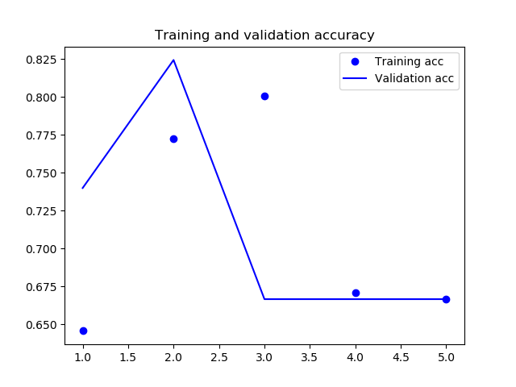
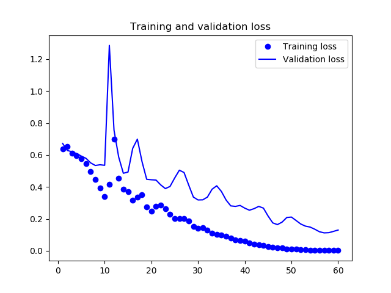

## 安装CPU版tensorflow 2.0

`pip install tensorflow`

2.0和1.x版本API接口变化较大

## 测试

### MNIST 示例

网上很多例子都是1.x的，导致花了很多时间找[demo](https://cloud.tencent.com/developer/article/1519704)

```python
import tensorflow as tf

mnist = tf.keras.datasets.mnist

(x_train, y_train),(x_test, y_test) = mnist.load_data()
x_train, x_test = x_train / 255.0, x_test / 255.0

model = tf.keras.models.Sequential([
  tf.keras.layers.Flatten(input_shape=(28, 28)),
  tf.keras.layers.Dense(512, activation=tf.nn.relu),
  tf.keras.layers.Dropout(0.2),
  tf.keras.layers.Dense(10, activation=tf.nn.softmax)
])
model.compile(optimizer='adam',
              loss='sparse_categorical_crossentropy',
              metrics=['accuracy'])

model.fit(x_train, y_train, epochs=5)
model.evaluate(x_test, y_test)
```
终端输出

```
Train on 60000 samples
Epoch 1/5
60000/60000 [==============================] - 10s 175us/sample - loss: 0.2207 - accuracy: 0.9348
Epoch 2/5
60000/60000 [==============================] - 9s 158us/sample - loss: 0.0948 - accuracy: 0.9712
Epoch 3/5
60000/60000 [==============================] - 10s 159us/sample - loss: 0.0684 - accuracy: 0.9782
Epoch 4/5
60000/60000 [==============================] - 9s 156us/sample - loss: 0.0532 - accuracy: 0.9828
Epoch 5/5
60000/60000 [==============================] - 9s 153us/sample - loss: 0.0428 - accuracy: 0.9862

- 1s 73us/sample - loss: 0.0328 - accuracy: 0.9807

```

5次迭代可以到达98%的准确率

## AMD显卡可以使用

`pip install tensorflow-rocm`

但是好像目前只支持Linux操作系统，坑人啊

## keras使用GPU

https://keras.io/why-use-keras/

https://github.com/plaidml/plaidml

AMD Opencl MNIST训练

Ran in 182.81759595870972 seconds

i5 CPU

Ran in 54.19514775276184 seconds

感觉Opencl就没必要用，还不如CPU优化的好。

VGG19模型预测


Using plaidml.keras.backend backend.
INFO:plaidml:Opening device "opencl_amd_hainan.0"
Running initial batch (compiling tile program)
Timing inference...
Ran in 39.326616525650024 seconds

Running initial batch (compiling tile program)
Timing inference...
Ran in 37.10606551170349 seconds

看来这个笔记本是没得救了

## 3种类型魔方分类

模型

```
Model: "sequential"
_________________________________________________________________
Layer (type)                 Output Shape              Param #
=================================================================
conv2d (Conv2D)              (None, 58, 78, 32)        896
_________________________________________________________________
max_pooling2d (MaxPooling2D) (None, 29, 39, 32)        0
_________________________________________________________________
conv2d_1 (Conv2D)            (None, 27, 37, 64)        18496
_________________________________________________________________
max_pooling2d_1 (MaxPooling2 (None, 13, 18, 64)        0
_________________________________________________________________
conv2d_2 (Conv2D)            (None, 11, 16, 128)       73856
_________________________________________________________________
max_pooling2d_2 (MaxPooling2 (None, 5, 8, 128)         0
_________________________________________________________________
conv2d_3 (Conv2D)            (None, 3, 6, 128)         147584
_________________________________________________________________
max_pooling2d_3 (MaxPooling2 (None, 1, 3, 128)         0
_________________________________________________________________
flatten (Flatten)            (None, 384)               0
_________________________________________________________________
dense (Dense)                (None, 128)               49280
_________________________________________________________________
dense_1 (Dense)              (None, 48)                6192
_________________________________________________________________
dense_2 (Dense)              (None, 3)                 147
=================================================================
Total params: 296,451
Trainable params: 296,451
Non-trainable params: 0
_________________________________________________________________
Found 780 images belonging to 3 classes.
Found 300 images belonging to 3 classes.

```




前面几次可能是因为训练初期下降方向未稳定下来导致的。

训练集780会不会太少了。

迭代5次可能不行，因为训练集都有780组。batch_size默认32，迭代60次尝试。

```
Model: "sequential"
_________________________________________________________________
Layer (type)                 Output Shape              Param #
=================================================================
conv2d (Conv2D)              (None, 58, 78, 32)        896
_________________________________________________________________
max_pooling2d (MaxPooling2D) (None, 29, 39, 32)        0
_________________________________________________________________
conv2d_1 (Conv2D)            (None, 27, 37, 64)        18496
_________________________________________________________________
max_pooling2d_1 (MaxPooling2 (None, 13, 18, 64)        0
_________________________________________________________________
conv2d_2 (Conv2D)            (None, 11, 16, 128)       73856
_________________________________________________________________
max_pooling2d_2 (MaxPooling2 (None, 5, 8, 128)         0
_________________________________________________________________
flatten (Flatten)            (None, 5120)              0
_________________________________________________________________
dense (Dense)                (None, 128)               655488
_________________________________________________________________
dense_1 (Dense)              (None, 36)                4644
_________________________________________________________________
dense_2 (Dense)              (None, 3)                 111
=================================================================
Total params: 753,491
Trainable params: 753,491
Non-trainable params: 0
_________________________________________________________________
Epoch 1/60
```


