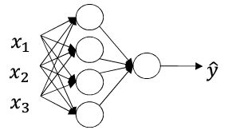
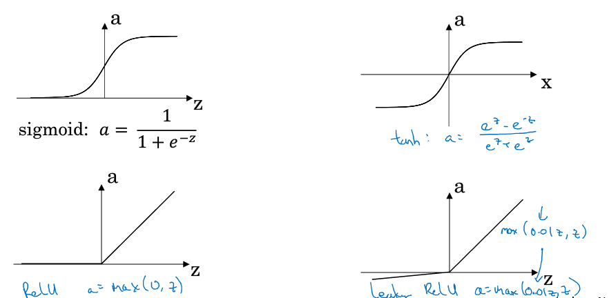

## 神经网络和深度学习

### 第一周 深度学习概率

简要介绍深度学习发展和课程内容

### 第二周 神经网络基础

logistic回归

m个输入样本x，x为n维列向量

m个输出y，y为二值

数据归一化用sigmoid函数，作为激活函数。提到了Relu激活函数，此函数由于其曲线特性，训练速度会很快。

假设我们认为输入和预测值$\hat{y}$满足如下关系

$ \hat{y}=\sigma(w^T x+b)=P(y=1 \vert x)$

也就是说预测值是代表给定输入x时y=1的概率。因为y只能是0和1，所以根据概率就能计算输出标签。

损失函数

$L( \hat{y},y)=-ylog(\hat{y}) + (1-y)log(1-\hat{y})$

为什么不用$L( \hat{y},y)= \frac{1}{2} (\hat{y}^2 - y^2)$

是为了使求解问题变成凸优化问题。

课程最后解释了，我们希望输出的预测值$\hat{y}$和实际值y

1. $y=1 P(y \vert x)=\hat{y}$
2. $y=0 P(y \vert x)=1-\hat{y}$

$P(y \vert x)=\hat{y}^y(1-\hat{y})^{(1-y)}$能满足上面两个式子，再由于log是单调的，这个最大就是求负最小。所以损失函数就是这么来的。

整体的概率等于所有样本的概率累积，取了log就变成了求和，除以样本数就是和样本规模无关的损失函数了。

最终的Cost函数就是所有样本损失函数的均值

单次迭代有

$ Z=w^T + b $

$ A = \sigma(Z) $

$ dZ = A - Y $

$ dw = \frac{1}{m} X dZ^T$

$ db = \frac{1}{m} dZ^T$

$ w = w - \alpha dw $

$ b = b - \alpha db $

这也是为什么就算多个样本也要多次迭代的原因。

个人理解：

和之前理解的训练不一样，最初以为是每个样本单次输入迭代到最后一个样本训练结束。而把所有样本作为单次迭代的训练方法，最后结果应该是接近最优解的。单个样本依次训练可能无法保证。

但是直观上来说，生物体在学习的过程中应该做不到每次都把所有的数据都训练一边。记忆有限，而且在网络训练过程中，早期输入的样本影响会很大，毕竟启蒙教育很重要……

超限学习ELM应该是一次把所有样本代入，直接通过最小二乘法计算权重。对于大量样本的训练可能不适合，这也是为何ELM是一个浅层神经网络。

### 第三周 浅层神经网络

用一个2层的神经网络作为示例，解释神经网络的正向和反向传播。

输入层为第0层

有一个隐含层，一个输出层，共2层,每层节点数用$n_l$表示

上图是针对单个样本而言

所有的输入输出样本都是列向量，即矩阵中每一列为一个样本，这点必须得明确。

$z^{[l](m)}_i$代表第m个样本在第l层第i个神经元的输入

约定[]内代表为层数，()内表示样本数

每个节点其实和之前的logistic是类似的

$\hat{y}=a=g(z)=g(w^T x+b)$

其中$g()$代表激活函数

顺带多介绍了几种激

除了sigmoid，还有tanh、ReLU和泄漏的ReLU

单个样本时

$z^{[l]}_i=w^T_i a^{[l-1]}+b_i$

$z^{[l]}=w^{[l]} a^{[l-1]}+b^{[l]}$

$w$的第i行即代表第i个单元的权重，b为偏置

$w^{[l]}_{n_l \times n_{l-1}}$

$b^{[l]}_{n_l \times 1}$

m个样本时

$Z^{[l]}=W^{[l]}A^{[l-1]}+B^{[l]}$

$A^{[l]}=g(Z^{[l]})$

为什么会引入非线性的激活函数呢？原因是如果激活函数是线性，那么输入输出之间的关系就是线性的。线性关系何必用深度学习呢……

吴恩达推荐在隐含层使用ReLU，最后一层根据实际情况选择。

反向传播时我们需要计算激活函数的导数$g'(x)$

