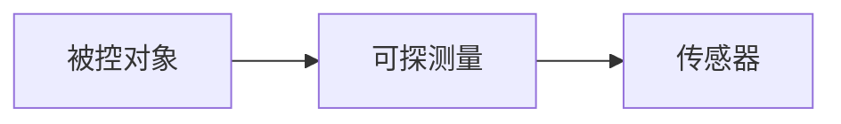

获取系统输入的元器件。

## 功能

获取被控对象的状态信息，获取到的状态信息一般不会是理想的。

可能有噪声、延时，甚至测量值不一定是直接从被控对象获取到的。

常见的传感器有：编码器、加速度计、陀螺仪、速度传感器、超声波传感器、激光测距仪等。

## 基本原理

## 数据预处理

因为测量值往往不是理想值，我们会对测量值进行一定的预处理。

常见的操作有：校正、转换和滤波。

### 校正

传感器制造误差会造成传感器自身测量值失真。此误差为系统误差，可以通过校正系数修正。

假设误差为线性的，可以设置一个offset和factor。

### 转换

假如测量值不是直接测量的，可以通过一个转换关系把测量值转换成控制器输入值。

转换关系和系统建模有关。

### [滤波](filter.md)

因为有噪声存在，需要对测量值进行滤波操作。从而得到一个被认为更真实的值。

滤波器的选择是需要有先验知识的。

假如预先知道噪声是高频的，可以使用低通滤波器。

被测信号是存在某一个范围，则可以选择带通滤波器。

{@todo}

补充常见滤波器

#### 一阶滤波器

$$
y_{n}=\alpha*x_{n}+(1-\alpha)*y_{n-1}
$$
$x$为采样值，$y$为滤波后的至。

其中$y_{n-1}$为上一周期滤波后的值，$x_{n}$为当前周期采样值。

一阶滤波器中$\alpha$越截止频率之间的关系

$$
f_{cut}=\frac{\alpha}{2{\pi}T}
$$

其中$T$为采样周期

$$\alpha=2{\pi}f_{cut}T$$

$\alpha$越小说明当前周期采样值权重越低，则滤波后的数据变化越平滑，对应低通滤波截止频率越低。

