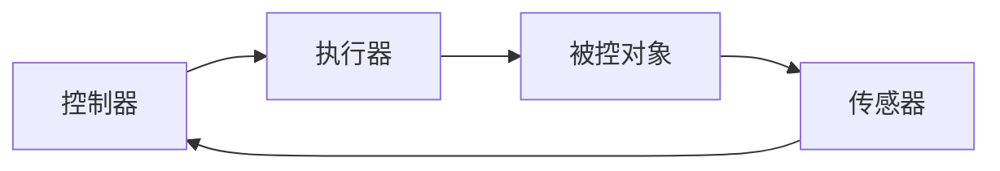

控制系统的核心内容。

## 功能

功能：通过逻辑计算，把逻辑值下发给执行器，从而改变被控对象的状态。

## 常见控制器

### PID控制器

无模型控制器，不需预先知道系统的传递函数就可以使用。

神奇的是PID控制器在绝大多数工程中可可用的，我们只需要调节PID参数即可获取到一个不错的控制效果。

连续PID控制器

$$
u(t)=K_pe(t)+K_i\int_0^te(\tau)d\tau+K_d\frac{d}{dt}e(t)
$$

$u(t)$ 为控制器输出
$e(t)$ 为设定值(Set Point)和测量值(Process Value)

把$K_p$提取出来，可以写成标准PID形式

$$
u(t)=K_p(e(t)+\frac{1}{T_i}\int_0^te(\tau)d\tau+T_d\frac{d}{dt}e(t))
$$

$T_i$ 积分时间
$T_d$ 微分时间

因为标准形式的PID表达式各项系数都有着具体的物理含义，所以工程上一般使用标准形式的PID表达式。

离散PID控制器

