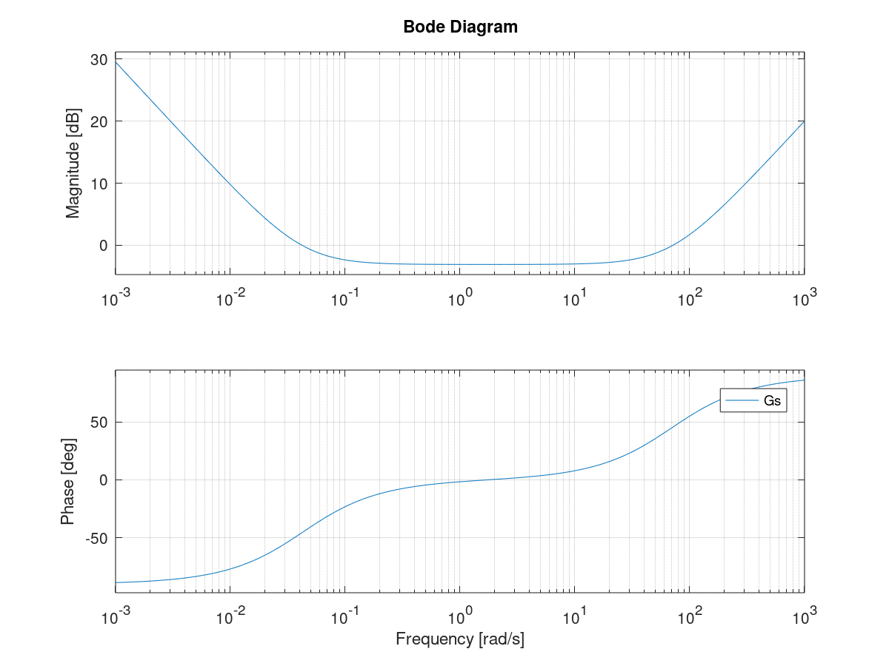

控制系统的核心内容。

## 功能

功能：通过逻辑计算，把逻辑值下发给执行器，从而改变被控对象的状态。


## 常见控制器

### PID控制器

无模型控制器，不需预先知道系统的传递函数就可以使用。

神奇的是PID控制器在绝大多数工程中可可用的，我们只需要调节PID参数即可获取到一个不错的控制效果。

#### 连续PID控制器

$$
u(t)=K_pe(t)+K_i\int_0^te(\tau)d\tau+K_d\frac{d}{dt}e(t)
$$

$u(t)$ 为控制器输出
$e(t)$ 为设定值(Set Point)和测量值(Process Value)

对上式做拉式变换，可以得到PID控制器的传递函数

$$
G(s)=K_p+\frac{K_i}{s}+K_ds=\frac{K_ds^2+K_ps+K_i}{s}
$$

使用Octave分析传递函数
```matlab
kp=0.7;
ki=0.03;
kd=0.01;
figure
Gs=tf([kd kp ki],[1]);
bode(Gs);
```



把$K_p$提取出来，可以写成标准PID形式

$$
u(t)=K_p(e(t)+\frac{1}{T_i}\int_0^te(\tau)d\tau+T_d\frac{d}{dt}e(t))
$$

$T_i$ 积分时间
$T_d$ 微分时间

因为标准形式的PID表达式各项系数都有着具体的物理含义，所以工程上一般使用标准形式的PID表达式。

若受控系统的传递函数为$H(s)$，则整个闭环回路的传递函数为$G(s)H(s)$。

以下内容为个人理解与疑问，需后续进一步研究确认。
>理解：
因为$H(s)$与受控系统的物理特性有关，认为是不会发生变化的。只需调节PID参数使$G(s)H(s)$的传输特性稳定即可。这也是为什么我们不需要知道受控系统的传递函数，仅靠一个调节过PID参数的控制器即可得到一个表现不错的闭环控制回路。
个人疑问：
假如我们给定一个初始的PID参数，仅含有比例系数。
在整个闭环回路不发散的情况下，测得闭环回路的传递函数，是否直接能够获取到$H(s)$？
如果我们计算出了$H(s)$，是否能够直接求得使得系统稳定的$G(s)$？
根据$G(s)$计算出积分和微分系数？
是不是就意味着能够自动标定PID系数了？

#### 离散PID控制器


@todo 
- 补充离散PID公式推导
- 补充某场景下仿真，例如一质量为1kg的木块，在桌面上的静摩擦力系数为Ks，动摩擦力系数为Km，电机出力为线性的F=K·Input。设置点从0m以最大加速度1m/s^2，最大速度0.5m/s走到1m处。分析计算整个行程内的位置误差和速度误差。假设采样周期为1ms。

C语言下的伪代码
```c
double previous_error=0.0;
double error=0.0;
//参数随机给定，无意义
double kp=0.7;
double ki=0.03;
double kd=0.01;
double setpoint=0.0;
double measured_value=0.0;
double integral,derivative,output;
double dt=1;
for(;;)
{
    //获取测量系统值，可滤波
    error = setpoint - measured_value;
    integral += error*dt;
    derivative = (error - previous_error)/dt;
    output = kp*error + ki*integral + kd*derivative;
    //对执行器开始操作
    previous_error = error;
}
```

坊间流传的PID调节口诀

>参数整定找最佳，从小到大顺序查.
先是比例后积分，最后再把微分加.
曲线振荡很频繁，比例度盘要放大.
曲线漂浮绕大湾，比例度盘往小扳.
曲线偏离回复慢，积分时间往下降.
曲线波动周期长，积分时间再加长.
曲线振荡频率快，先把微分降下来.
动差大来波动慢，微分时间应加长.
理想曲线两个波，前高后低四比一.
一看二调多分析，调节质量不会低.


### LQG控制器

https://zh.wikipedia.org/zh-hans/LQG%E6%8E%A7%E5%88%B6
https://baike.baidu.com/item/LQR

https://blog.csdn.net/heyijia0327/article/details/39270597

https://wenku.baidu.com/view/ca8f8b68b84ae45c3b358c9a.html

LQG即线性二次高斯控制

### MPC

https://baike.baidu.com/item/MPC/3586091


