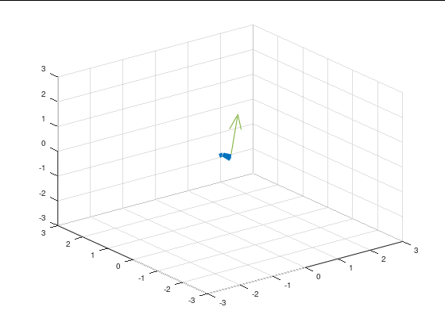

<!---
版本    日期    作者    描述
v1.0    2019.06.20  lous    文件创建

-->

在进行姿态估计过程中，我们需要进行坐标系转化。

图像识别定位过程，也会有相机坐标系和世界坐标系之间的转化。

## 三维直角坐标系转化


### 旋转矩阵表示

绕 $X$、$Y$ 或 $Z$ 单个轴旋转 $θ$ （右手螺旋）

$$
\begin{bmatrix}x' \\ y' \\ z'\end{bmatrix} = R * \begin{bmatrix}x \\ y \\ z\end{bmatrix}
$$

其中 $R$ 就是三阶的旋转矩阵。

仅绕坐标轴的旋转矩阵可表示为

$$
R_X=\begin{bmatrix} 1&0&0\\ 0&cos\theta&-sin\theta\\ 0&sin\theta&cos\theta \end{bmatrix}
$$

$$
R_Y=\begin{bmatrix} cos\theta&0&sin\theta\\ 0&1&0\\ -sin\theta&0&cos\theta \end{bmatrix}
$$

$$
R_Z=\begin{bmatrix} cos\theta&-sin\theta&0\\ sin\theta&cos\theta&0\\ 0&0&1 \end{bmatrix}
$$

任意一个旋转都可以由三个旋转组合得到。

通过旋转矩阵不能直观地看出旋转的方向和角度。

旋转变换本身只有3个自由度，但旋转矩阵有9个元素，因此旋转矩阵中的元素不是相互独立的，这在非线性优化中会带来问题。


### 旋转向量表示

设旋转向量的单位向量为 r，模为 θ。三维点（或者说三维向量）p 在旋转向量 r 的作用下变换至 p′，则：

$$
p'=\cos\theta\cdot p+(1-\cos\theta)(p\cdot r)r+\sin\theta\cdot r \times p
$$


### 旋转向量和旋转矩阵之间的转换关系

设旋转向量的单位向量 $r=[r_x\ r_y\ r_z]^T$，旋转角度为 $θ$，对应的旋转矩阵为 $R$，则 $r$ 到 $R$ 的转换是：

$$
R = \cos\theta I+(1- \cos\theta) r r^T+\sin\theta
\begin{bmatrix}
0&-r_z&r_y\\
r_z&0&-r_x\\
-r_y&r_x&0
\end{bmatrix}
$$

其中 $I$ 是三阶单位矩阵。反过来 $R$ 到 $r$ 的转换则可以利用等式：

$$
\frac{R-R^T}{2}=\sin\theta
\begin{bmatrix}
0&-r_z&r_y\\
r_z&0&-r_x\\
-r_y&r_x&0
\end{bmatrix}
$$

### 四元数表示

$$
q = q_0 + q_1 i + q_2 j + q_3 k
$$

其中

$$
 \begin{array}{l} {i^2} = {j^2} = {k^2} =  - 1\\ ij = k,ji =  - k\\ jk = i,kj =  - i\\ ki = j,ik =  - j \end{array}
$$

绕单位向量$\mathbf{n}=\left[ n_x, n_y, n_z \right]^T$进行了角度为θ的旋转，那么这个旋转的四元数形式为：

$$
q = \left[ \cos \frac{\theta}{2}, n_x \sin \frac{\theta}{2}, n_y \sin \frac{\theta}{2}, n_z \sin \frac{\theta}{2}\right]^T
$$

根据四元数$q$我们也可以知道其旋转角和旋转轴

$$
q = q_0 + q_1 i + q_2 j + q_3 k
$$

$$
\theta  = 2\arccos{ q_0 }
$$

$$
 [ n_x , n_y , n_z ]^T = [q_1,q_2,q_3]^T \sin \frac{\theta}{2} 
$$

把三维空间点$[x,y,z]$用一个虚四元数$\mathbf{p}$来描述：

$$
\mathbf{p} = [0, x, y, z]
$$

$$
\mathbf{n}=[ n_x, n_y, n_z ]^T
$$

$$
\mathbf{q} = [\cos \frac{\theta}{2}, \mathbf{n} \sin \frac{\theta}{2} ].
$$

四元数的共轭为：

$$
\mathbf{q}^* = s - xi - yj - zk = [s, -\mathbf{v}]
$$

四元数的模长定义为：

$$
\| \mathbf{q} \| = \sqrt{ s^2 + x^2 + y^2 + z^2 }
$$

四元数的逆为：

$$
\mathbf{q}^{-1} = \mathbf{q}^* / \| \mathbf{q} \| ^2
$$

四元数$\mathbf{q}_a$和$\mathbf{q}_b$的乘为：

$$
\begin{array}{lll} \mathbf{q}_a \mathbf{q}_b & = &  s_a s_b - x_ax_b - y_ay_b - z_az_b \\ && + ( s_ax_b + x_as_b + y_az_b - z_ay_b )i \\ &&+ ( s_ay_b - x_az_b + y_as_b + z_ab_b )j \\ &&+ ( s_az_b + x_ay_b - x_by_a + z_as_b )k  \end{array}
$$

旋转后的点$\mathbf{p}'$即可表示为这样的乘积

$$
\mathbf{p}' = \mathbf{q} \mathbf{p} \mathbf{q}^{-1}
$$

$\mathbf{p}'$的虚部即为转换后的坐标点$[x',y',z']$

Octave 下四元数计算点$[1, 1, 1]$绕$[-1, -1, 1]$



```matlab
function dst = quaternion_rotate(src,axis,theta)
% lous quaternion_rotate - rotate a 3-D point src
% around axis theta radian
%
% Syntax: dst = quaternion_rotate(src,axis,theta)
%

pkg load quaternion
theta=theta/2;
p_src=quaternion (0,src(1),src(2),src(3));
q=quaternion(cos(theta),sin(theta)*axis(1),sin(theta)*axis(2),sin(theta)*axis(3));
qinv = inv (q);
p_dst=(q.*p_src).*qinv;
dst=[p_dst.x,p_dst.y,p_dst.z];
    
end
```

## 参考

- [视觉SLAM中的数学基础 第四篇 李群与李代数（2）](https://www.cnblogs.com/gaoxiang12/p/5577912.html)

- [三维坐标变换——旋转矩阵与旋转向量](https://blog.csdn.net/mightbxg/article/details/79363699)

- [世界坐标系和相机坐标系,图像坐标系的关系](https://blog.csdn.net/waeceo/article/details/50580607)

- [视觉SLAM中的数学基础 第二篇 四元数](https://www.cnblogs.com/gaoxiang12/p/5120175.html)