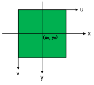
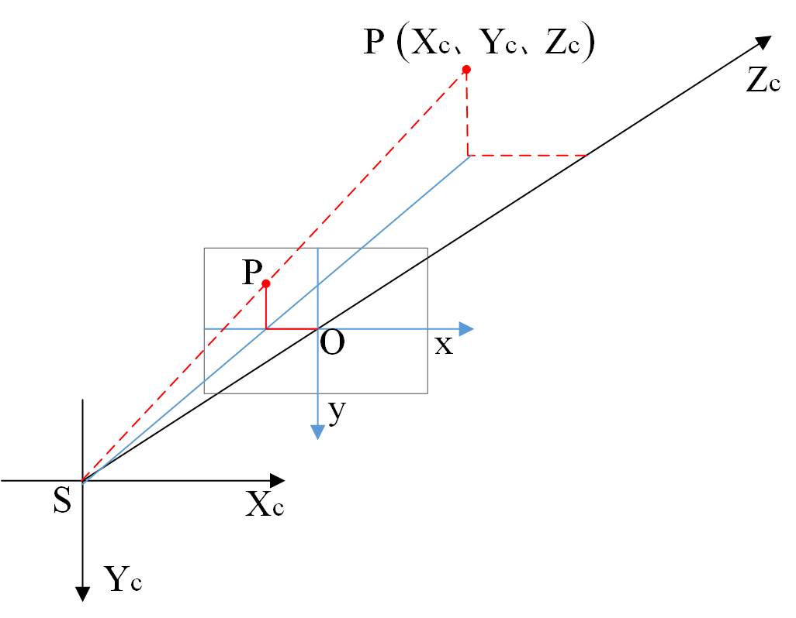

因相机检测到的位置在二维像坐标系下，而在大多数融合算法中我们都是用的全局坐标系。

[坐标系的转换的理论基础](../../mathmatic/page/coordinate_system.md)

## 相机标定方法

常见的标定方法有
直接线性变换法(DLT)、张正友标定

### DLT

直接线性变换法

#### 像素平面与像平面

物理坐标$(x_0,y_0)$对应像素坐标$(u_0,v_0)$

$$
u = \frac{x}{dx}+u_0
$$

$$
v = \frac{y}{dy}+v_0
$$

$dx$为在$x$方向上每个像素的宽度；$dy$为在$y$方向上每个像素的高度。

*为何把转换矩阵从2X3填充至3X3?*

$$
\begin{bmatrix}u\\ v\\ 1\end{bmatrix}=\begin{bmatrix}\frac{1}{dx} & 0 & u_{0}\\ 0 & \frac{1}{dy} & v_{0}\\ 0 & 0 & 1\end{bmatrix}\begin{bmatrix}x\\ y\\ 1\end{bmatrix}
$$

#### 像平面与像空间

$$
 \begin{matrix} \frac{x}{f}=\frac{X_{C}}{Z_C} \\ \frac{y}{f}=\frac{Y_C}{Z_C} \end{matrix} \Rightarrow  \begin{matrix}Z_C\cdot x=f\cdot X_C \\ Z_C \cdot y=f\cdot Y_{C}\end{matrix}
$$

$$
Z_C \begin{bmatrix}x\\ y\\ 1\end{bmatrix}=\begin{bmatrix}f & 0 & 0 & 0\\ 0 & f & 0 & 0\\ 0 & 0 & 1 & 0\end{bmatrix} \begin{bmatrix}X_C\\ Y_C\\ Z_C\\ 1\end{bmatrix}
$$

#### 像空间坐标与全局坐标系

$$
\begin{bmatrix}X_{C}\\ Y_{C}\\ Z_{C}\end{bmatrix}=R\begin{bmatrix}X\\ Y\\ Z\end{bmatrix}+\begin{bmatrix}X_{S}\\ Y_{S}\\ Z_{S}\end{bmatrix}
$$

$$
\begin{bmatrix}X_{C}\\ Y_{C}\\ Z_{C}\\1\end{bmatrix}=\begin{bmatrix}R & t\\ 0^{T} & 1\end{bmatrix}\begin{bmatrix}X\\ Y\\ Z\\1\end{bmatrix}=T\begin{bmatrix}X\\ Y\\ Z\\1\end{bmatrix}
$$

$$
R=\begin{bmatrix}r_{11} & r_{12} & r_{13}\\ r_{21} & r_{22} & r_{23}\\ r_{31} & r_{32} & r_{33}\end{bmatrix}
$$

$$
t=\begin{bmatrix}t_{1}\\ t_{2}\\ t_{3}\end{bmatrix}
$$

#### 像空间和全局坐标系

$$
Z_C \begin{bmatrix} u\\ v\\ 1\end{bmatrix}=\begin{bmatrix}\frac{1}{dx} & 0 & u_{0}\\ 0 & \frac{1}{dy} & v_{0}\\ 0 & 0 & 1\end{bmatrix}\begin{bmatrix}f & 0 & 0 & 0\\ 0 & f & 0 & 0\\ 0 & 0 & 1 & 0\end{bmatrix}\begin{bmatrix}R & t\\ 0^{T} & 1\end{bmatrix}\begin{bmatrix}X\\ Y\\ Z\\1\end{bmatrix}
$$

$$
Z_C \begin{bmatrix} u\\ v\\ 1\end{bmatrix}=\begin{bmatrix}l_{1} & l_{2} & l_{3} & l_{4}\\ l_{5} & l_{6} & l_{7} & l_{8}\\ l_{9} & l_{10} &  l_{11}& l_{12}\end{bmatrix}\begin{bmatrix}X\\ Y\\ Z\\1 \end{bmatrix}
$$

其中

$$
Z_{C}=l_{9}X+l_{10}Y+l_{11}Z+l_{12}
$$

$$
u=(l_{1}X+l_{2}Y+l_{3}Z+l_{4})/Z_{C}
$$

$$
v=(l_{5}X+l_{6}Y+l_{7}Z+l_{8})/Z_{C}
$$

$$
u=\frac{l_{1}X+l_{2}Y+l_{3}Z+l_{4}}{l_{9}X+l_{10}Y+l_{11}Z+1}
$$

$$
v=\frac{l_{5}X+l_{6}Y+l_{7}Z+l_{8}}{l_{9}X+l_{10}Y+l_{11}Z+1}
$$

其中$l_{1}$至$l_{12}$各值为：

$$
\begin{matrix}
l_{1} &=& \frac{f\cdot r_{11}}{dx}+u_{0}\cdot r_{31} \\
l_{2} &=& \frac{f\cdot r_{12}}{dx}+u_{0}\cdot r_{32} \\
l_{3} &=& \frac{f\cdot r_{13}}{dx}+u_{0}\cdot r_{33} \\
l_{4} &=& \frac{f\cdot t_{1}}{dx}+u_{0}\cdot t_{3} \\
l_{5} &=& \frac{f\cdot r_{21}}{dx}+v_{0}\cdot r_{31} \\
l_{6} &=& \frac{f\cdot r_{22}}{dx}+v_{0}\cdot r_{32} \\
l_{7} &=& \frac{f\cdot r_{23}}{dx}+v_{0}\cdot r_{33} \\
l_{8} &=&\frac{f\cdot t_{2}}{dx}+v_{0}\cdot t_{3} \\
l_{9} &=& r_{31} \\
l_{10}&=& r_{32} \\
l_{11}&= &r_{33} \\
l_{12}&=&t_{3} \\
\end{matrix}
$$

#### 求解

$$
\begin{bmatrix}X & 0 \\ Y &0 \\ Z &0 \\ 1 &0 \\ 0 & X \\ 0 & Y \\ 0 & Z \\ 0 &1 \\ -Xu & -Xv \\ -Yu & -Yv \\ -Zu & -Zv \end{bmatrix}^T \begin{bmatrix} l_{1} \\ l_{2} \\ l_{3} \\ l_{4} \\ l_{5} \\ l_{6} \\ l_{7} \\ l_{8} \\ l_{9} \\ l_{10} \\ l_{11} \end{bmatrix}-\begin{bmatrix} u \\ v \end{bmatrix} = 0 \Rightarrow BL=C
$$

$$
L = (B^T B)^{-1} (B^T C)
$$

内参数计算
 通过旋转矩阵的特性可求得相机的内参数

$$
\begin{matrix}u_{0}=l_{1}l_{9}+l_{2}l_{10}+l_{3}l_{11} \\ v_{0}=l_{5}l_{9}+l_{6}l_{10}+l_{7}l_{11} \\ f_{u}=\sqrt{l_{1}^{2}+l_{2}^{2}+l_{3}^{2}-u_{0}^{2}} \\ f_{v}=\sqrt{l_{5}^{2}+l_{6}^{2}+l_{7}^{2}-v_{0}^{2}}\end{matrix}
$$

### 张正友标定

暂无

## 参考

- [直接线性变换解法（DLT）用于标定相机](https://www.cnblogs.com/ambition921009/p/10769262.html)
- [相机标定 张正友经典标定法详解](https://www.cnblogs.com/wangguchangqing/p/8335131.html)