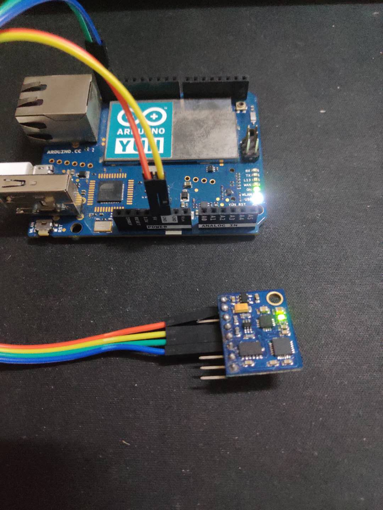
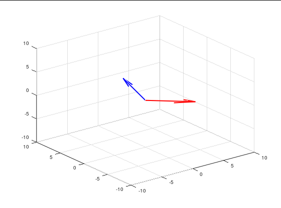

<!---
版本    日期    作者    描述
v1.0    2019.06.19  lous    文件创建

-->

Arduino 通过 IIC 总线获取到 GY-85的传感器数据，再通过串口与Octave通讯发送数据。Octave 获取到原始数据并融合估计当前的姿态。




## GY-85

一款低精度的9DOF传感器，包含三个芯片：加速度计、磁力计、陀螺仪。其中陀螺仪包含了当前的温度，可用来做校正。故一共可以获采集到当前的3X加速度、3X角速度、3X磁通量、1X温度，共10路信号。

## Arduino

通过I2C总线获取传感器数据并通过串口发送给上位机PC。

```c
#include "GY_85.h"
#include <Wire.h>

GY_85 GY85; //create the object

void setup()
{
    Wire.begin();
    delay(10);
    Serial.begin(115200);
    delay(10);
    GY85.init();
    delay(10);
}

void loop()
{

    static uint8_t gy85_buff[6 + 6 + 8];

    //x-y-z axis[0]=10 axis[1]=32 axis[2]=54
    GY85.read_acclerometer_raw(gy85_buff);
    //x-y-z axis[0]=01 axis[1]=45 axis[2]=34
    GY85.read_compass_raw(gy85_buff + 6);
    //x-y-z-temp axis[0]=45 axis[1]=23 axis=[2]=67 axis[4]=01
    GY85.read_gyro_raw(gy85_buff + 6 + 6);

    //acc x y z [1,0] [3,2] [5,4]
    //compass x y z [6,7] [10,11] [8,9]
    //gyro x y z t [16,17] [14,15] [18,19] [12,13]

    if (Serial.availableForWrite() > 20)
    {
        Serial.write(gy85_buff, 20);
    }
}

```


## Octave Serial

上位机PC上Octave通过串口获取到Arduino发送的数据，解析并完成校正。（后续后考虑把数据校正直接放在Arduino内完成）

### 数据采集


```matlab
function [acc_data,gyro_data,compass_data] = gy85_sample(sample_num)
%sample_num 采样次数

pkg load instrument-control

%%if (exist("serial") == 3)
%%    disp("Serial: Supported")
%%else
%%    disp("Serial: Unsupported")
%%endif

s1 = serial("COM5", 115200,10);
srl_flush(s1); 
pause_time=0.005;%发送后等待再读取数据

acc=zeros(1,3);
compass=zeros(1,3);
gyro=zeros(1,4);
%temporature=gyro(4);% 35+( raw + 13200 ) / 280

%% 绕各轴旋转 校正加速度传感器
for i=1:sample_num
  %%srl_write(s1, "refresh");
  %% 等待arduino 返回数据
  %%pause(pause_time)
  [uint8_data,count] = srl_read(s1,20);
  if(count<20)
    disp("count<20 lost data")
  endif
  raw_data(i,:)=uint8_data;
end

for i=1:sample_num
  %% 按指定格式解析数据
  uint8_data=raw_data(i,:);
  [acc,compass,gyro]=parse_data(uint8_data);
  acc_data(i,:)=acc;
  gyro_data(i,:)=gyro;
  compass_data(i,:)=compass;
end

fclose(s1) % Closes and releases serial interface object

endfunction
```

### 数据解析

解析数据协议需要和Arduino一致

```matlab
function [acc, compass, gyro] = parse_data(uint8_data)
    % raw data present in the order below
    %acc-x y z [1,0] [3,2] [5,4]
    %compass x y z [6,7] [10,11] [8,9]
    %gyro x y z t [16,17] [14,15] [18,19] [12,13]
    data = double(uint8_data);
    %% acc data
    acc(1) = data(2) * 256 + data(1);
    acc(2) = data(4) * 256 + data(3);
    acc(3) = data(6) * 256 + data(5);
    %% compass data
    compass(1) = data(7) * 256 + data(8);
    compass(2) = data(11) * 256 + data(12);
    compass(3) = data(9) * 256 + data(10);
    %% gyro data
    gyro(1) = data(17) * 256 + data(18);
    gyro(2) = data(15) * 256 + data(16);
    gyro(3) = data(19) * 256 + data(20);
    gyro(4) = data(13) * 255 + data(14);
    % convert to the number that matlab can compute
    acc = acc .* (acc < 2^15) - (2^16 + 1 - acc) .* (acc >= 2^15);
    compass = compass .* (compass < 2^15) - (2^16 + 1 - compass) .* (compass >= 2^15);
    gyro = gyro .* (gyro < 2^15) - (2^16 + 1 - gyro) .* (gyro >= 2^15);

endfunction

```


### 计算姿态并作图

不做滤波和数据融合

```matlab
function imu_real_time()

    title('Acc-Red Mag-Blue')
    filename='GY-85 Acc Mag.gif';
    for i = 1:10

        [acc_data, gyro_data, compass_data] = gy85_sample(1);

        % g=9.8;
        % acc factor and offset
        acc_offset = [5.6804; 13.827; 5.8449; 12.519; 0.46976; 14.399];
        offset = [acc_offset(1), acc_offset(3), acc_offset(5)];
        scale = [acc_offset(2), acc_offset(4), -acc_offset(6)];
        % calibration acc data
        acc_uvw = (acc_data - offset) ./ scale;
        % normalization compass vector
        compass_uvw = 5 * compass_data / norm(compass_data);
        % current positon
        pos = [0, 0, 0];
        plot_uvw(pos, [acc_uvw; compass_uvw]);
        % save image as gif
        drawnow;
        frame = getframe(1);
        im = frame2im(frame);
        [imind,cm] = rgb2ind(im);
        
        if i == 1;
        imwrite(imind,cm,filename,'gif', 'Loopcount',inf,'DelayTime',1);
        else
        imwrite(imind,cm,filename,'gif','WriteMode','append','DelayTime',1);
        end
        pause(0.05)
    end

endfunction

```

红色-加速度方向

蓝色-磁力计方向



### 传感器融合

静态磁力计所计算出来地磁场方向是相对准确的。

静态加速度传感器所计算出来的重力方向也是相对准确的。

因为地磁场方向和重力方向在环境未发生变化的是整体是不会发生变化的，所以静态我们根据磁力计和加速度计就可以估算出当前传感器的三维姿态。

当前时刻加速度计测得$\overrightarrow{a_k}$


