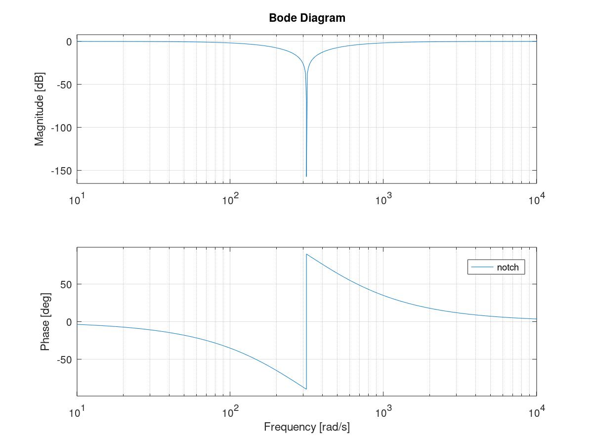
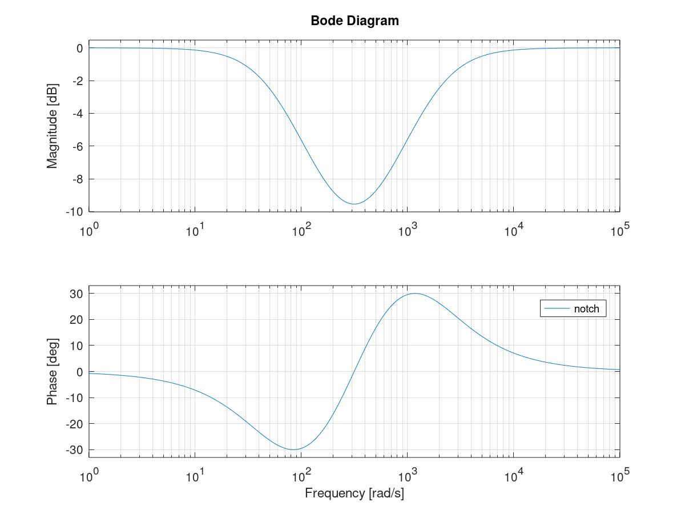

<!---
版本    日期    作者    描述
v1.0    2019.06.13  lous    文件创建

-->

## Notch 滤波器

工程上有时为了降低开环传函的某个特殊频率的幅频响应，会在控制器输出加上一个Notch滤波器。

理想的Notch滤波器是一个点阻滤波器。

### NYU Notch Filter

```matlab
clear;close all;clc;
pkg load control
%抑制频率为50Hz
f_n=50;
omega_n=2*pi*f_n;
notch=tf([1 0 omega_n^2],[1 2*omega_n omega_n^2]);
figure
bode(notch)
```




### 带阻尼 Notch Filter

有时可能不需要幅频曲线那么尖锐，我们可以增加一个阻尼系数

```matlab
clear;close all;clc;
pkg load control
%抑制频率为50Hz
f_n=50;
%阻尼系数
damping=3;
omega_n=2*pi*f_n;
notch=tf([1 2*omega_n omega_n^2],[1 2*damping*omega_n omega_n^2]);
figure
bode(notch)
```




