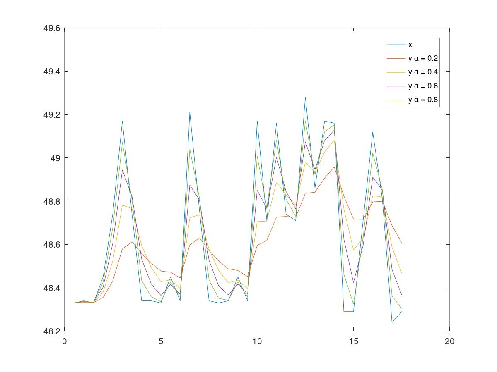
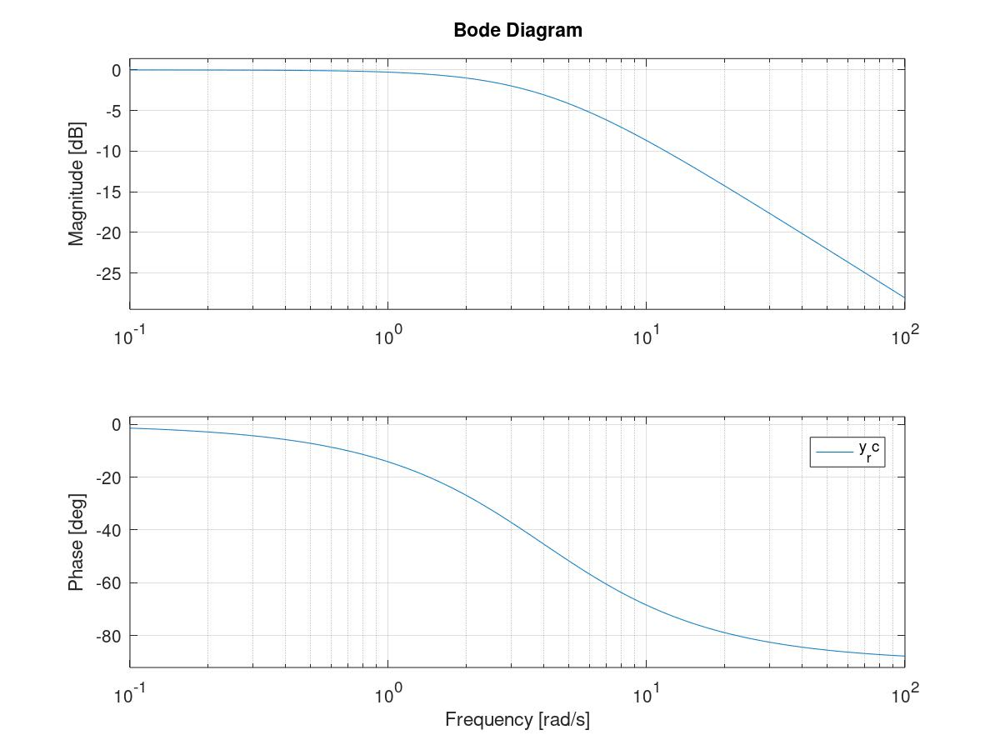

<!---
版本    日期    作者    描述
v1.0    2019.06.03  lous    文件创建

-->

通过[Arduino 超声波模块](arduino_uno_sonar)获取到距离的原始值

*Octave*为一款类Matlab的开源科学计算软件。

设置不同的滤波参数后得到的滤波图形如下



Octave 源码(未在matlab下测试)如下

```matlab
%数字滤波器示例
%

clear;close all;clc;
%超声波传感器采集到的距离数据
%采样周期500ms 单位cm
x=[48.33	48.34	48.33	48.45	48.74	49.17	48.74	48.34	48.34	48.33	48.45	48.34	49.21	48.76	48.34	48.33	48.34	48.45	48.34	49.17	48.71	49.16	48.74	48.71	49.28	48.86	49.17	49.16	48.29	48.29	48.71	49.12	48.81	48.24	48.29];

function y=rc_filter(alpha,x)
  y=x;
for i=2:length(x)
    y(i)=alpha*x(i)+(1-alpha)*y(i-1);
endfor
endfunction

%alpha=0.3;
y_2=rc_filter(0.2,x);
y_4=rc_filter(0.4,x);
y_6=rc_filter(0.6,x);
y_8=rc_filter(0.8,x);


%采样周期500ms
sample_period=0.5;
t=sample_period*[1:length(x)];

figure
plot(t,x,t,y_2,t,y_4,t,y_6,t,y_8);
legend('x','y \alpha = 0.2','y \alpha = 0.4','y \alpha = 0.6','y \alpha = 0.8');


```

可以看到$\alpha$数值越小，滤波后的曲线确实是越平滑的。虽然滤波系数能够滤掉高频噪声，但是信号失真会更加严重。

一阶滤波器中$\alpha$越截止频率之间的关系

$$
f_{cut}=\frac{\alpha}{2{\pi}T}
$$

其中$T$为采样周期

$$\alpha=2{\pi}f_{cut}T$$

因为我们采样周期$T=0.5$s，采样频率$f_s=\frac{1}{T}=2$Hz.
所以当滤波器截止频率为0.2Hz时，$\alpha=2{\pi}\times{0.2}\times{0.5}=0.62832$

此时滤波器的Bode图



```matlab
%计算一阶滤波器Bode图
figure
f_cut=0.2;%截止频率
RC=1/2/pi/f_cut;
pkg load control
lpf = tf(1,[RC 1]);
bode(lpf);
```

实际工程应用过程中，会根据当前运动状态对$\alpha$做适当的调整，从而满足自适应的要求。

@todo 补充自适应的应用场景
