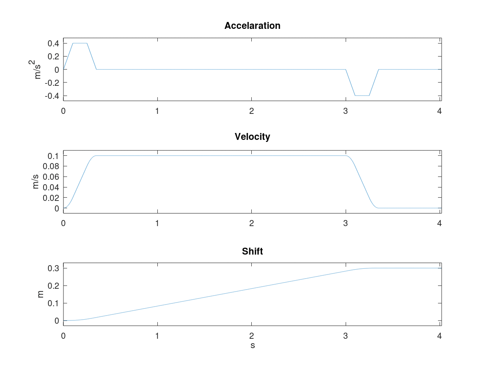

对直线运动的单轴，在给定约束的情况下可以做一个最基础的三阶轨迹规划

[推导过程](../../controller/md/spg.md)


Octave 三阶规划

```matlab
function [t,acc,vel,shift,switch_time]=spg(sp,jerk,max_acc,max_vel,distance)
%运动方向
direction=sign(distance);
%加速度曲线分段的边界
time=zeros(7,1);
t_jerk=abs(max_acc/jerk);
t_acc=abs(max_vel/max_acc);
t_vel=abs(distance/max_vel);
time(1)=t_jerk;
time(2)=t_acc;
time(3)=t_jerk+t_acc;
time(4)=t_vel;
time(5)=t_vel+t_jerk;
time(6)=t_vel+t_acc;
time(7)=t_vel+t_acc+t_jerk;
switch_time=time;
%根据采样周期和运动总时间计算出的时间轴
t=0:sp:time(7)*1.2;
%加速度分段表达式
acc=jerk*t.*(t>=0 & t<time(1)) ...
+max_acc.*(t>=time(1) & t<time(2)) ...
+(max_acc-jerk*(t-time(2))).*(t>=time(2) & t< time(3)) ...
+0.*(t>=time(3) & t<time(4)) ...
+(-jerk*(t-time(4))).*(t>=time(4) & t<time(5)) ...
+(-max_acc).*(t>=time(5) & t<time(6)) ...
+(-max_acc+jerk*(t-time(6))).*(t>=time(6) & t<=time(7));
%增加加速方向
acc=direction*acc;

%加速度积分求速度
vel=zeros(size(t));
for i=1:length(t)
vel(i)=sum(acc(1:i));
end
vel=vel*sp;

%速度积分求加速度
shift=zeros(size(t));
for i=1:length(t)
shift(i)=sum(vel(1:i));
end
shift=shift*sp;
```

测试并绘图

```matlab
clear;close all;clc;

%加加速度 m/s^3
jerk=4;
%加速度 m/s^2
acc=0.4;
%速度 m/s
vel=0.1;
%距离 m
dist=-0.3;
%采样周期 s
sample_period=0.001;

[t,acc,vel,shift,switch_time]=spg(sample_period,jerk,acc,vel,dist);

%绘图
figure
subplot(311);
plot(t,acc);
ylim([(max(acc)+min(acc))*0.5-(max(acc)-min(acc))*0.6,
 (max(acc)+min(acc))*0.5+(max(acc)-min(acc))*0.6]);
xlim([0 t(end)]);
title("Accelaration");
ylabel('m/s^2')

subplot(312);
plot(t,vel);
ylim([(max(vel)+min(vel))*0.5-(max(vel)-min(vel))*0.6,
 (max(vel)+min(vel))*0.5+(max(vel)-min(vel))*0.6]);
xlim([0 t(end)]);
title("Velocity");
ylabel('m/s')

subplot(313);
plot(t,shift);
ylim([(max(shift)+min(shift))*0.5-(max(shift)-min(shift))*0.6,
 (max(shift)+min(shift))*0.5+(max(shift)-min(shift))*0.6]);
xlim([0 t(end)]);
title("Shift");
ylabel('m')
xlabel('s')
```

绘制得到曲线如下



其中加速度拐点时间为
```
switch_time =
   0.10000
   0.25000
   0.35000
   3.00000
   3.10000
   3.25000
   3.35000
```

轨迹规划模型现在已经有了