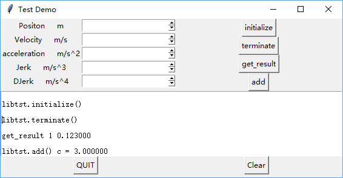

<!---
版本    日期    作者    描述
v1.0    2019.06.10  lous    文件创建

-->

利用Python自带GUI调用C语言库实现混合编程。

## Tkinter

Python原生GUI库，款平台支持比较好，功能一般。普通的测试Demo足够了。
不同版本python中库的首字母大小写可能有所不同，导入模块的时候需要注意。

有人对常用的GUI库做了个简单的归纳
>- Tkinter: python内置的GUI框架，使用TCL实现，python中内嵌了TCL解释器，使用它的时候不用安装额外的扩展包，直接import，跨平台。不足之处在于UI布局全靠代码实现，只有15种常用部件，显示效果简陋。
>- Wxpython：用得比较广泛，跨平台，C++编写，需要安装扩展模块；文档少，遇到问题不好解决，代码布局控件，不直观。
>- Pygtk： python对GTK+GUI库的封装，在linux平台上运行的比较好，需要安装扩展模块，在windows下的兼容性有一些问题。
>- pyqt：QT原本是诺基亚的产品，源码用C++写的，python对QT的包装，跨平台，本地显示效果，根据系统决定，在win7下就是win7的显示效果；pyqt与qt的函数接口一致，qt开发问的那个丰富，所以pyqt开发文档也比较丰富；控件丰富，函数/方法多，拖曳布局；方便打包成二进制文件；GPL协议，商业程序需要购买商业版授权
>- pyside：诺基亚的亲儿子，python对QT的封装，安装扩展模块，跨平台，与pyqt的API一样，LGPL协议，新软件可以是私有的，代码布局
>- Kivy： 针对多点触控程序，智能手机平板等，也可以在没有触屏功能的系统上，全平台支持；使用python和cython（python和c语言的接口）编写；中文支持差，需要自己下载中文库并且制定路径。
作者：田同学的小迷妹儿
链接：https://www.jianshu.com/p/ef71566ff8bb
来源：简书
简书著作权归作者所有，任何形式的转载都请联系作者获得授权并注明出处。

## ctypes

ctypes库能把python类型和C类型数据一一对应起来

python根据动态库的符号表能识别到库内的函数，并根据传递的参数类型判断参数偏移地址从而使用C语言库。

以下是python3.6.5官方手册内的类型转换关系，python的类型果然更加无脑些~

ctypes type | C type | Python type 
| :------| :------ | :------ |
c_bool | _Bool | bool (1) 
c_char | char |1-character bytes object 
c_wchar | wchar_t |1-character string 
c_byte | char |int 
c_ubyte | unsigned char |int 
c_short | short |int 
c_ushort | unsigned short |int 
c_int | int |int 
c_uint | unsigned int |int 
c_long | long |int 
c_ulong | unsigned long |int 
c_longlong | __int64 or long long |int 
c_ulonglong | unsigned __int64 or unsigned long long | int 
c_size_t | size_t| int 
c_ssize_t | ssize_t or Py_ssize_t |int 
c_float |float |float 
c_double |double |float 
c_longdouble |long double |float 
c_char_p |char * (NUL terminated) |bytes object or None 
c_wchar_p |wchar_t * (NUL terminated) |string or None 
c_void_p |void * |int or None 


## C语言库

写一个C库并编译

头文件test.h(只是编译库给Python用，其实可以不用头文件)
```c
typedef struct
{
    int int_result;
    double double_result;
} RESULT_STRUCT;

int download();
int add(int a,int b,double *c );
int initialize();
int terminate();
int get_status();
int get_result(RESULT_STRUCT* result);

```
库实现test.c

```c

#include <stdio.h>
#include <stdlib.h>
#include "test.h"

int download()
{
    printf("CDLL Download\n");
    return 0;
}

int add(int a,int b,double *c )
{
    *c=a+b;
    printf("CDLL %d + %d = %lf \n",a,b,*c);
    return 0;
}

int  initialize()
{
    printf("CDLL initialize\n");
    return 0;
}

int  terminate()
{
    printf("CDLL terminate\n");
    return 0;
}

int get_status()
{
    printf("CDLL get_status\n");
    return 0;
}

int get_result(RESULT_STRUCT* result)
{
    printf("CDLL get_result\n");
    result->double_result=0.123;
    result->int_result=1;
    return 0;
}
```

本地是用code::blocks 17.12 自带的Mingw32-gcc编译的release版本

## python 脚本

```python
#!/usr/bin/env python
# -*- coding: utf8 -*-
#Author : lous
from tkinter import *
import sys
import os
from ctypes import *
from struct import *
#Author : lous

class RESULT_STRUCT(Structure):
    _fields_ = [("int_result",  c_int),
                ("double_result",  c_double)]

class Application(Frame):

    def load_dll(self):
        """载入动态库"""
        self.libtst = CDLL('libpython_clib.dll')

    def app_relase(self):
        """退出界面时释放资源"""
        self.relase_resource()
        self.quit()
        
    def relase_resource(self):
        """释放申请的资源"""
        pass
    
    def footprint(self, message):
        self.result_text.insert(1.0,"\n"+message+"\n")
        
    def result_clear(self):
        self.result_text.delete(1.0,END)

    def download(self):
        """调用download"""
        rtn=self.libtst.download()
        self.footprint("libtst.download()")
        
    def add(self):
        """调用add"""
        c=c_double(0)
        rtn=self.libtst.add(1,2,byref(c))
        self.footprint("libtst.add() c = %f" %(c.value))

    def initialize(self):
        """调用initialize"""
        rtn=self.libtst.initialize()
        self.footprint("libtst.initialize()")
    def terminate(self):
        """调用terminate"""
        rtn=self.libtst.terminate()
        self.footprint("libtst.terminate()")
    def get_result(self):
        """调用get_result"""
        result=RESULT_STRUCT()
        rtn=self.libtst.get_result(byref(result))
        self.footprint("get_result %d %lf" %(result.int_result,result.double_result))

    def createWidgets(self):
        #root frame
        self.root_frame=Frame(self).grid(sticky=N+S+E+W)
        #输入frame
        self.input_frame=Frame(self.root_frame)
        self.input_frame.grid(row=0,column=0,sticky=N+S+E+W)
        self.create_input_frame()
        #子 frame
        self.sub_frame=Frame(self.root_frame)
        self.sub_frame.grid(row=0,column=1,sticky=N+S+E+W)
        self.create_sub_frame()
        #输出框
        self.output_frame=Frame(self.root_frame)
        self.output_frame.grid(row=2,column=0,columnspan=2,sticky=N+S+E+W)
        self.create_output_frame()

    def create_input_frame(self):
        self.position_sb=Spinbox(self.input_frame)
        self.position_sb.grid(row=0,column=1)
        self.position_label=Label(self.input_frame,text="Positon     m")
        self.position_label.grid(row=0,column=0)
        self.velocity_sb=Spinbox(self.input_frame)
        self.velocity_sb.grid(row=1,column=1)
        self.velocity_label=Label(self.input_frame,text="Velocity     m/s")
        self.velocity_label.grid(row=1,column=0)
        self.acceleration_sb=Spinbox(self.input_frame)
        self.acceleration_sb.grid(row=2,column=1)
        self.acceleration_label=Label(self.input_frame,text="acceleration     m/s^2")
        self.acceleration_label.grid(row=2,column=0)
        self.jerk_sb=Spinbox(self.input_frame)
        self.jerk_sb.grid(row=3,column=1)
        self.jerk_label=Label(self.input_frame,text="Jerk     m/s^3")
        self.jerk_label.grid(row=3,column=0)
        self.djerk_sb=Spinbox(self.input_frame)
        self.djerk_sb.grid(row=4,column=1)
        self.djerk_label=Label(self.input_frame,text="DJerk     m/s^4")
        self.djerk_label.grid(row=4,column=0)
        
    def create_sub_frame(self):
        #initialize
        self.initialize_btn = Button(self.sub_frame)
        self.initialize_btn["text"] = "initialize"
        self.initialize_btn["command"] =  self.initialize
        self.initialize_btn.grid(row=0)
        #terminate
        self.terminate_btn = Button(self.sub_frame)
        self.terminate_btn["text"] = "terminate"
        self.terminate_btn["command"] = self.terminate
        self.terminate_btn.grid(row=1)
        #get_result
        self.get_status_btn = Button(self.sub_frame)
        self.get_status_btn["text"] = "get_result"
        self.get_status_btn["command"] =  self.get_result
        self.get_status_btn.grid(row=2)
        #add
        self.add_btn = Button(self.sub_frame)
        self.add_btn["text"] = "add"
        self.add_btn["command"] =  self.add
        self.add_btn.grid(row=3)

    def create_output_frame(self):
        self.result_text=Text(self.output_frame,height=8)
        self.result_text.grid(columnspan=2)
        ##滚动条
        #self.result_scrollbar=Scrollbar(self.output_frame)
        #self.result_scrollbar.grid(row=8,column=1,sticky=N+S)
        #self.result_scrollbar.config(command=self.result_text.yview)
        #self.result_text.config(yscrollcommand=self.result_scrollbar.set)
        self.result_clear_btn = Button(self.output_frame)
        self.result_clear_btn["text"] = "Clear"
        self.result_clear_btn["command"] =  self.result_clear
        self.result_clear_btn.grid(row=1,column=1)
        #创建退出
        self.QUIT = Button(self.output_frame)
        self.QUIT["text"] = "QUIT"
        self.QUIT["command"] =  self.app_relase
        self.QUIT.grid(row=1)

    def __init__(self, master=None):
        Frame.__init__(self, master)
        #master.geometry("1280x720")
        self.load_dll()
        #initialize_resource()
        self.createWidgets()

root = Tk()
HRIS = Application(master=root)
HRIS.master.title("Test Demo")
HRIS.mainloop()
root.destroy()
```
## 测试

C库在终端打印的信息

```
CDLL 1 + 2 = 3.000000
CDLL get_result
CDLL terminate
CDLL initialize
```

Tkinter界面



左侧的输入在这个示例中没有使用上，只是显示tkinter有输入、输出和按钮等常规功能。若需要更进一步的功能，可以查找tkinter的官方文档。

如果功能比较复杂，可以考虑PyQt（最起码界面操作简单好看）

