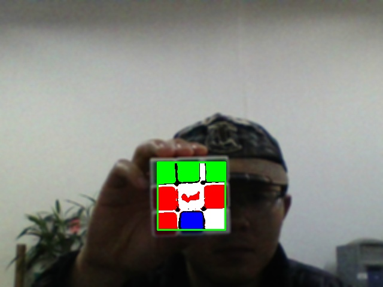
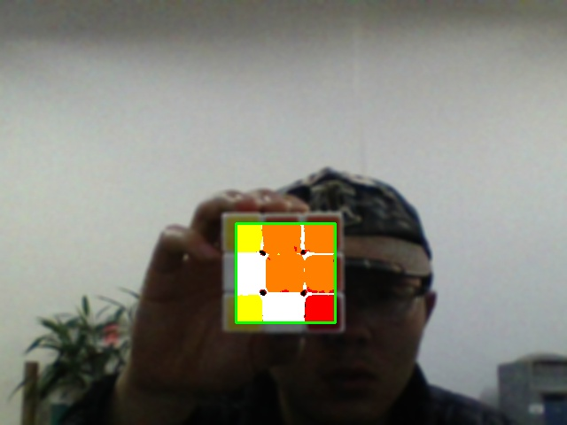

# 魔方还原

这篇文章将会介绍如何用Python2.7 和opencv-python2.4及Vpython 通过摄像头获取到魔方的当前状态，并通过动画演示如何还原到最初始的状态。

假设你已经具备了如下条件：

1. 电脑上已经安装了Python2.7，opencv2.4 for python，Vpython。（目前版本只支持windows 系统，并且测试是在x64_win10）。
2. 了解基本的图像处理和模式识别的原理，具备基本的python 编程能力和Vpython 动画渲染的能力。3.最重要的是知道该如何玩魔方……

现在将正式进入到正文内容

在识别到魔方所在区域之后，我们只需要识别出魔方每个面的当前状态就可以重建出魔方整体的情况

 
 
 
  
 
   
 
    

     

最终的视频
<video src="../video/stepByStep.mp4" controls="controls">
您的浏览器不支持 video 标签。
</video>

[还原视频-优酷](http://v.youku.com/v_show/id_XMjcwMzk0NDM3Ng==.html)

