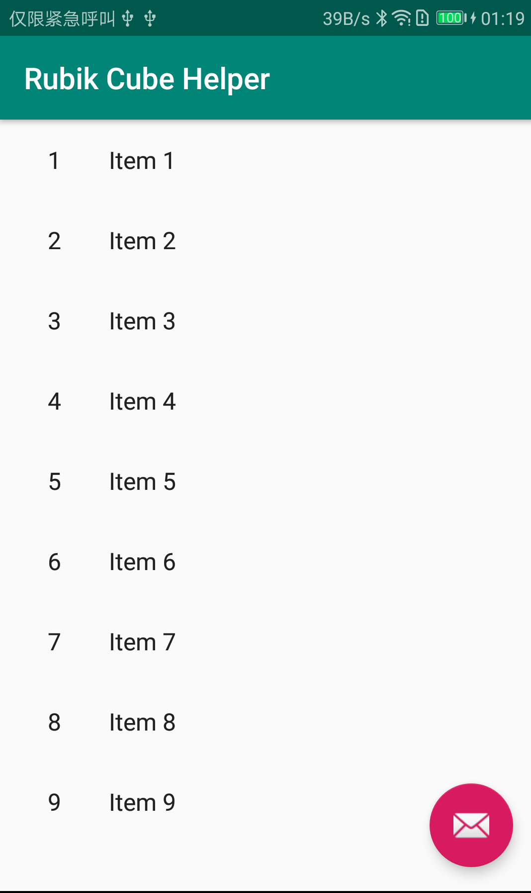
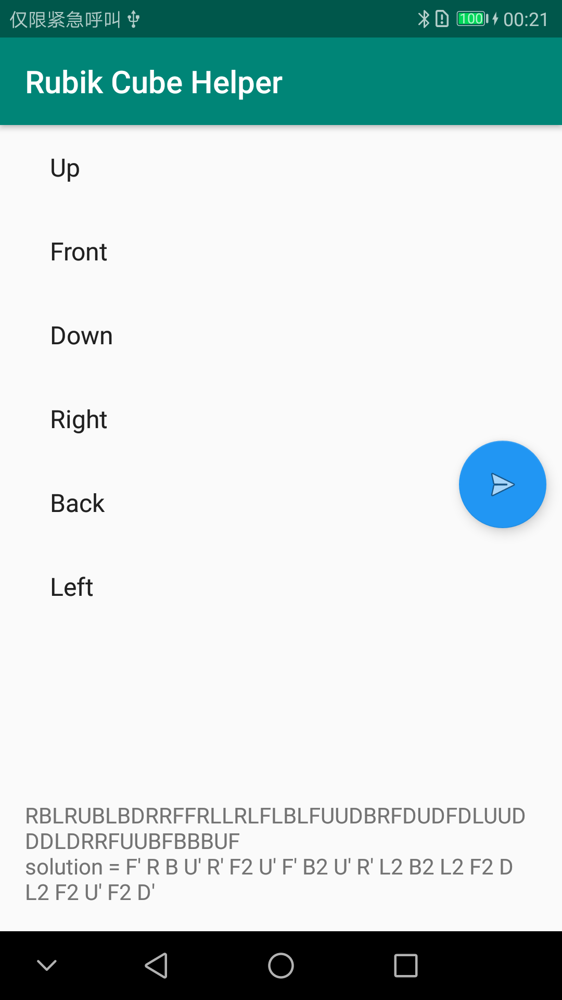
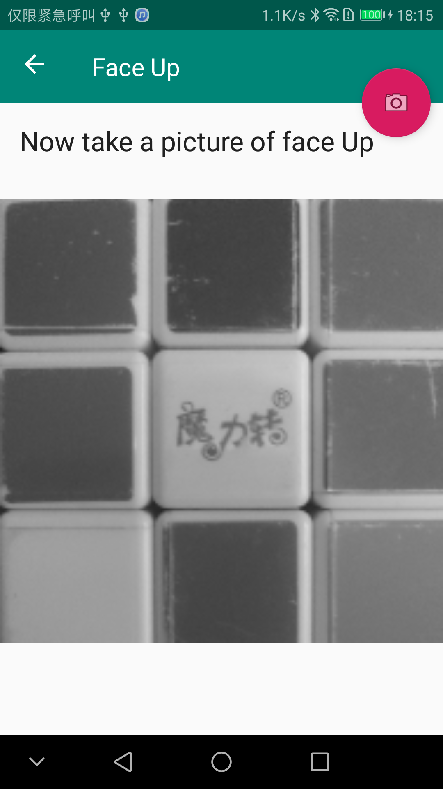
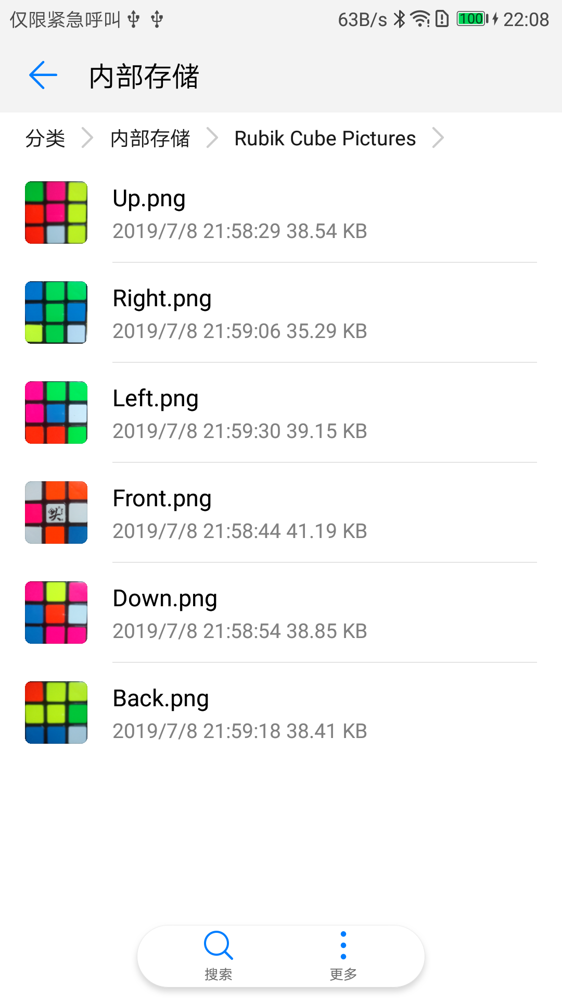
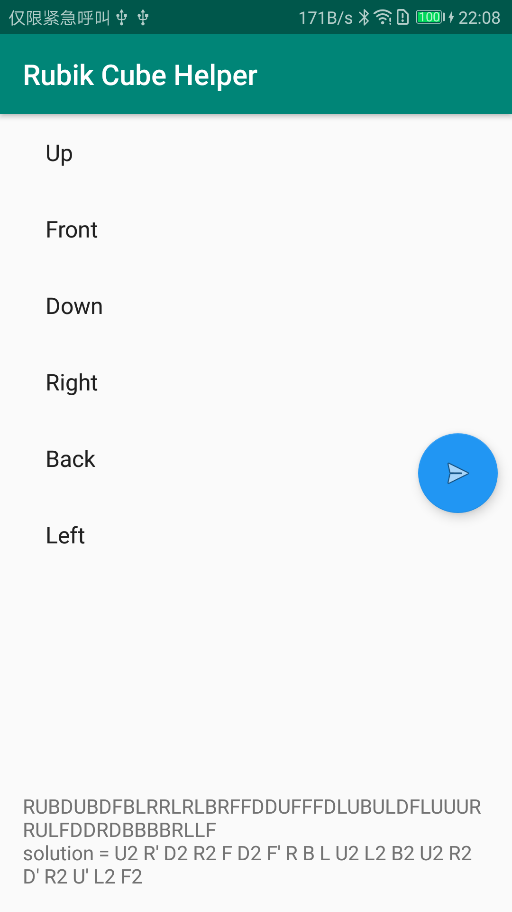

初步在安卓上实现魔方还原助手。之前考虑用Qt框架实现跨平台，但相应的移动端开发资料实在是太少，暂时不考虑。后续考虑跨平台实现的可能性。

因为之前没有接触过安卓开发，没法具体到每步该如何开展，但是可以把开发阶段分为以下几大步

1. 利用手机拍摄魔方6个面
2. 根据拍摄的图像识别当前魔方状态
3. 根据魔方当前状态计算还原步骤
4. 动画示意魔方还原步骤

## Android Studio 开发

[安装教程参考](http://www.runoob.com/w3cnote/android-tutorial-android-studio.html)

[Android Studio 官网下载](https://developer.android.google.cn/studio)

安装好后启动


新建一个新的项目

`Rubik Cube Helper`

真心好难用……各种被封

SDK使用代理

`mirrors.neusoft.edu.cn:80`

gradle 不太清楚作用是什么

而且`gradle.properties`文件代理出bug导致一直提示无法下载，删除重复项后可以下载了


C:\Users\name\.gradle\gradle.properties

居然也会有重复项……

项目的`build.gradle`里加上代理

```
allprojects {
    repositories {
        google()
        jcenter()
        maven { url 'http://maven.aliyun.com/nexus/content/groups/public/' }
    }
}
```

到选择一个模板稍作修改，编译部署



编译环境已经搭建好了，我们现在需要考虑如何实现拍照并存图。

## 拍照

先使用系统自带的API，熟悉安卓应用的基本开发之后再考虑做一个带有标记的拍照界面，类似微信扫一扫。

可能需要先学习Java……

主活动


子页面拍照


保存至本地


到这一步可以用octave离线计算

因为相机拍摄的有空隙，所以手动截取了

后续需要补充手机应用自动截取保存

```
Up.png
   2   5   1
   2   6   2
   4   5   5
Front.png
   2   6   1
   6   1   6
   3   5   6
Down.png
   2   2   3
   1   2   4
   3   1   2
Right.png
   6   3   4
   3   4   1
   5   3   5
Back.png
   6   3   5
   2   3   1
   1   5   4
Left.png
   3   4   1
   6   5   4
   6   4   4
```
人肉对比了下，应该是正确的

## Kociemba 还原算法

随机生成魔方状态并还原



结果显示在底部

## 图像识别实现

Android 好像自带矩阵运算，可以考虑用直接用矩阵运算解决。

[Android开发常用开源框架：图片处理](https://blog.csdn.net/axi295309066/article/details/56984137)

经过半天的折腾最终Android Studio 下opencv配置好了。

转灰度图了



## 安卓App可识别并给出还原步骤

Mark下 2019年7月8日 22点02分
经过一个星期的努力，现在软件终于可以实现拍照并给出还原步骤




相机拍摄到的六个面原始图像

```
2019-07-08 22:05:29.648 W/CubeState: loadImages() >
2019-07-08 22:05:29.648 W/CubeState: loadImage() > Up.png
2019-07-08 22:05:29.652 W/CubeState: loadImage() /storage/emulated/0/Rubik Cube Pictures/Up.png
2019-07-08 22:05:29.662 W/CubeState: width=188 height=188
2019-07-08 22:05:29.663 W/CubeState: loadImage() < 
2019-07-08 22:05:29.663 W/CubeState: loadImage() > Right.png
2019-07-08 22:05:29.664 W/CubeState: loadImage() /storage/emulated/0/Rubik Cube Pictures/Right.png
2019-07-08 22:05:29.669 W/CubeState: width=188 height=188
2019-07-08 22:05:29.669 W/CubeState: loadImage() < 
2019-07-08 22:05:29.669 W/CubeState: loadImage() > Front.png
2019-07-08 22:05:29.671 W/CubeState: loadImage() /storage/emulated/0/Rubik Cube Pictures/Front.png
2019-07-08 22:05:29.675 W/CubeState: width=188 height=188
2019-07-08 22:05:29.676 W/CubeState: loadImage() < 
2019-07-08 22:05:29.676 W/CubeState: loadImage() > Down.png
2019-07-08 22:05:29.677 W/CubeState: loadImage() /storage/emulated/0/Rubik Cube Pictures/Down.png
2019-07-08 22:05:29.682 W/CubeState: width=188 height=188
2019-07-08 22:05:29.683 W/CubeState: loadImage() < 
2019-07-08 22:05:29.683 W/CubeState: loadImage() > Left.png
2019-07-08 22:05:29.685 W/CubeState: loadImage() /storage/emulated/0/Rubik Cube Pictures/Left.png
2019-07-08 22:05:29.690 W/CubeState: width=188 height=188
2019-07-08 22:05:29.690 W/CubeState: loadImage() < 
2019-07-08 22:05:29.690 W/CubeState: loadImage() > Back.png
2019-07-08 22:05:29.692 W/CubeState: loadImage() /storage/emulated/0/Rubik Cube Pictures/Back.png
2019-07-08 22:05:29.697 W/CubeState: width=188 height=188
2019-07-08 22:05:29.697 W/CubeState: loadImage() < 
2019-07-08 22:05:29.698 W/CubeState: loadImages() <
2019-07-08 22:05:29.698 W/CubeState: toGray() >
2019-07-08 22:05:29.699 W/CubeState: toGray() <
2019-07-08 22:05:29.699 W/CubeState: getCubeEdgeColor() >
2019-07-08 22:05:29.699 W/CubeState: getGraySumMat() >
2019-07-08 22:05:29.701 W/CubeState: getGraySumMat() <
2019-07-08 22:05:29.701 W/CubeState: getCubeEdgeColor() Core.mean(graySumMat)117.79023313716614
2019-07-08 22:05:29.701 W/CubeState: getFaceletCenter() >
2019-07-08 22:05:29.702 W/CubeState: getFaceletCenter() <
2019-07-08 22:05:29.702 W/CubeState: getCubeEdgeColor() edge color is black
2019-07-08 22:05:29.702 W/CubeState: getCubeEdgeColor() facelet center mean = 140.66666666666666
2019-07-08 22:05:29.702 W/CubeState: getCubeEdgeColor() grayCentersMat [ 3*3*CV_8UC1, isCont=true, isSubmat=false, nativeObj=0x7f7b4406a0, dataAddr=0x7f897feec0 ]
2019-07-08 22:05:29.702 W/CubeState: getCubeEdgeColor() <
2019-07-08 22:05:29.702 W/CubeState: getHSV() >
2019-07-08 22:05:29.703 W/CubeState: getFaceletCenter() >
2019-07-08 22:05:29.704 W/CubeState: getFaceletCenter() <
2019-07-08 22:05:29.705 W/CubeState: getFaceletCenter() >
2019-07-08 22:05:29.706 W/CubeState: getFaceletCenter() <
2019-07-08 22:05:29.707 W/CubeState: getFaceletCenter() >
2019-07-08 22:05:29.707 W/CubeState: getFaceletCenter() <
2019-07-08 22:05:29.709 W/CubeState: getFaceletCenter() >
2019-07-08 22:05:29.709 W/CubeState: getFaceletCenter() <
2019-07-08 22:05:29.711 W/CubeState: getFaceletCenter() >
2019-07-08 22:05:29.711 W/CubeState: getFaceletCenter() <
2019-07-08 22:05:29.713 W/CubeState: getFaceletCenter() >
2019-07-08 22:05:29.713 W/CubeState: getFaceletCenter() <
2019-07-08 22:05:29.714 W/CubeState: getHSV() <
2019-07-08 22:05:29.714 W/CubeState: getSaturationGray() >
2019-07-08 22:05:29.714 W/CubeState: getSaturationGray() Up getFaceletCenter
2019-07-08 22:05:29.714 W/CubeState: getFaceletCenter() >
2019-07-08 22:05:29.715 W/CubeState: getFaceletCenter() <
2019-07-08 22:05:29.715 W/CubeState: getSaturationGray() Right getFaceletCenter
2019-07-08 22:05:29.715 W/CubeState: getFaceletCenter() >
2019-07-08 22:05:29.716 W/CubeState: getFaceletCenter() <
2019-07-08 22:05:29.717 W/CubeState: getSaturationGray() Front getFaceletCenter
2019-07-08 22:05:29.717 W/CubeState: getFaceletCenter() >
2019-07-08 22:05:29.717 W/CubeState: getFaceletCenter() <
2019-07-08 22:05:29.718 W/CubeState: getSaturationGray() Down getFaceletCenter
2019-07-08 22:05:29.718 W/CubeState: getFaceletCenter() >
2019-07-08 22:05:29.718 W/CubeState: getFaceletCenter() <
2019-07-08 22:05:29.719 W/CubeState: getSaturationGray() Left getFaceletCenter
2019-07-08 22:05:29.719 W/CubeState: getFaceletCenter() >
2019-07-08 22:05:29.719 W/CubeState: getFaceletCenter() <
2019-07-08 22:05:29.720 W/CubeState: getSaturationGray() Back getFaceletCenter
2019-07-08 22:05:29.720 W/CubeState: getFaceletCenter() >
2019-07-08 22:05:29.720 W/CubeState: getFaceletCenter() <
2019-07-08 22:05:29.720 W/CubeState: getSaturationGray() >
2019-07-08 22:05:29.720 W/CubeState: getWhiteThresh() >
2019-07-08 22:05:29.724 W/CubeState: getHueThresh()   hueThresh  [0]=4 [1]=37 [2]=70 [3]=102 [4]=164
2019-07-08 22:05:29.724 W/CubeState: getHueThresh() <
2019-07-08 22:05:29.724 W/CubeState: getLabel() >
2019-07-08 22:05:29.725 W/CubeState: getLabel()   colorLabel  [0]=4 [1]=6 [2]=3 [3]=2 [4]=6 [5]=3 [6]=2 [7]=1 [8]=3 [9]=5 [10]=4 [11]=4 [12]=5 [13]=4 [14]=5 [15]=3 [16]=4 [17]=1 [18]=1 [19]=2 [20]=2 [21]=6 [22]=1 [23]=1 [24]=1 [25]=2 [26]=5 [27]=6 [28]=3 [29]=6 [30]=5 [31]=2 [32]=1 [33]=5 [34]=6 [35]=6 [36]=6 [37]=4 [38]=4 [39]=6 [40]=5 [41]=1 [42]=2 [43]=2 [44]=4 [45]=2 [46]=3 [47]=3 [48]=3 [49]=3 [50]=4 [51]=5 [52]=5 [53]=1
2019-07-08 22:05:29.725 W/CubeState: getLabel() <
2019-07-08 22:05:29.726 W/CubeState: getLabelString()  faceLabel  [0]=6 [1]=4 [2]=1 [3]=2 [4]=5 [5]=3
2019-07-08 22:05:29.726 W/ItemListActivity: kociembaInput RUBDUBDFBLRRLRLBRFFDDUFFFDLUBULDFLUUURRULFDDRDBBBBRLLF
2019-07-08 22:05:29.750 W/ItemListActivity: kociemba solution = U2 R' D2 R2 F D2 F' R B L U2 L2 B2 U2 R2 D' R2 U' L2 F2 

```

不到1s时间内读图处理并给出还原步骤



## 待优化问题


## 参考

- [Android Studio开发入门-引用jar及so文件](https://www.cnblogs.com/xrwang/p/AndroidStudioImportJarAndSoLibrary.html)
- [Android Studio-—使用OpenCV的配置方法和demo以及开发过程中遇到的问题解决](https://www.cnblogs.com/yunfang/p/6149831.html)
- [使用Android Studio创建OpenCV 4.1.0 项目](https://blog.csdn.net/userhu2012/article/details/89522851)

